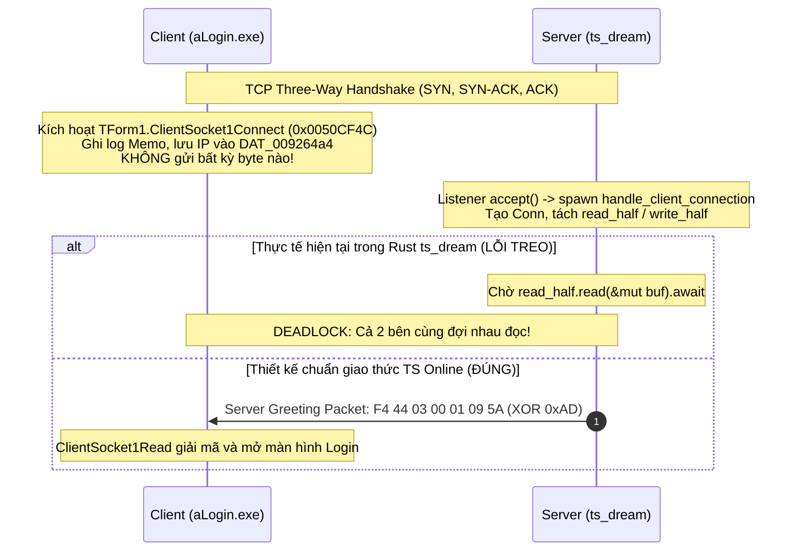

# Nghiên Cứu Chi Tiết: Đối Chiếu Luồng Kết Nối Ban Đầu Giữa Client TS Online (aLogin.exe) và Server Rust (ts_dream)

**Ngày lập**: 2026-09-16  
**Trạng thái**: Hoàn thành nghiên cứu & đề xuất giải pháp kỹ thuật  
**Đối tượng khảo sát**:
- **Client**: `aLogin.exe` (Mã nguồn C decompile từ Ghidra & Disassembly x86 trong `client_pseudo_c/`).
- **Server**: `ts_dream` (Rust asynchronous server engine trên nền Tokio/Axum/SQLx).

---

## 1. Tổng Quan & Bối Cảnh Kỹ Thuật

Trong kiến trúc client-server của tựa game MMORPG cổ điển **TS Online** (phát triển bởi ChineseGamer International, phát hành tại Việt Nam bởi Asiasoft), luồng giao tiếp ban đầu khi khởi động máy khách (`aLogin.exe`) và kết nối đến Game/Login Server đóng vai trò sống còn.

### Hiện tượng phát hiện (The Core Discovery)
Qua đối chiếu giữa mã decompile C/Assembly x86 của máy khách `aLogin.exe` và mã nguồn Rust hiện tại của `ts_dream`:
1. **Máy khách không bao giờ chủ động gửi tin nhắn trước (Client never speaks first)**: Sự kiện `ClientSocket1Connect` của máy khách chỉ thuần túy ghi log IP và lưu cấu trúc mạng; nó **hoàn toàn thụ động** chờ máy chủ gửi gói tin chỉ thị cảnh (Scene Switch).
2. **Máy chủ Rust hiện tại đang chờ Client gửi trước**: Trong hàm `handle_client_connection` ([`src/web/server_control.rs:347`](file:///mnt/d/VUDT/GIT_PCC/ts_dream/src/web/server_control.rs#L347)), server sau khi `accept()` TCP stream liền lập tức đi vào vòng lặp `read_half.read(&mut buf).await` mà **không gửi bất kỳ gói tin khởi đầu nào**.
3. **Hậu quả**: Nếu kết nối bằng client `aLogin.exe` nguyên bản, kết nối sẽ rơi vào trạng thái **Deadlock / Treo vĩnh viễn** — Client đợi Server gửi lệnh mở màn hình đăng nhập, trong khi Server đợi Client gửi gói tin xác thực!
4. **Hằng số `HELLO_REPLY` bị bỏ quên và sai lệch**: Trong [`src/server/spawn.rs:44`](file:///mnt/d/VUDT/GIT_PCC/ts_dream/src/server/spawn.rs#L44), hằng số `HELLO_REPLY = "F4440300010901"` đã được định nghĩa nhưng **không được gọi ở bất kỳ đâu** trong toàn bộ codebase, đồng thời giá trị cảnh `0x01` của nó lệch so với Login Scene chuẩn (`0x5A` = 90) của client.

Tài liệu này phân tích chi tiết từng bước (Step-by-step) trên cả hai phía Client và Server, chỉ ra bản chất toán học của các điều kiện trong client, và cung cấp giải pháp patch mã nguồn Rust để đạt độ tương thích 100% với giao thức nhị phân gốc.

---

## 2. Khảo Sát Primary Sources (Nguồn Đối Chiếu Gốc)

### 2.1. Client Decompiled Source (`client_pseudo_c/` & x86 Assembly)

| Thành phần / Hàm | Địa chỉ Entry | File nguồn tham chiếu | Vai trò trong luồng kết nối |
| :--- | :---: | :--- | :--- |
| `TForm1.ClientSocket1Connect` | `0x0050CF4C` | `client_pseudo_c/index.csv:2788`<br/>(Tham chiếu: `.scratch/client-pseudo-op-code/login_flow_research.md §1`) | Xử lý sự kiện TCP socket kết nối thành công. Ghi log IP, **hoàn toàn không gửi dữ liệu**. |
| `TForm1.ClientSocket1Read` | `0x0050CD6C` | `client_pseudo_c/index.csv:2787`<br/>(Tham chiếu: `.scratch/client-pseudo-op-code/login_flow_research.md §2`) | Bắt sự kiện `FD_READ`, giải mã XOR `0xAD`, deframe `F4 44` + Length `L`, đưa payload vào queue. |
| `TForm1.CY_AddRevQueue` | `0x00516108` | [`client_pseudo_c/00516108_TForm1.CY_AddRevQueue.c`](file:///mnt/d/VUDT/GIT_PCC/ts_dream/client_pseudo_c/00516108_TForm1.CY_AddRevQueue.c) | Đẩy payload vào `TStringList DAT_00926e88` của hàng đợi nhận. |
| `TForm1.CY_DelRevQueue` | `0x00516158` | (Tham chiếu: `login_flow_research.md §2.3`) | Timer 30ms pop payload, tách `MainOp` (DL) và `RestPayload` (ECX), gọi dispatcher. |
| `FUN_0078a89c` | `0x0078A89C` | [`client_pseudo_c/0078a89c_FUN_0078a89c.c`](file:///mnt/d/VUDT/GIT_PCC/ts_dream/client_pseudo_c/0078a89c_FUN_0078a89c.c)<br/>[`0078a89c_FUN_0078a89c.asm.txt`](file:///mnt/d/VUDT/GIT_PCC/ts_dream/client_pseudo_c/0078a89c_FUN_0078a89c.asm.txt) | Dispatcher cấp 1: tra bảng byte `0x78A8EE` và bảng dword `0x78A9B6`. Với `MainOp = 0x01` $\to$ nhảy sang `0x0078B149`. |
| `FUN_0078b149` (Case 2) | `0x0078B149` | [`client_pseudo_c/case_002_0078B149_FUN_0078b149.c`](file:///mnt/d/VUDT/GIT_PCC/ts_dream/client_pseudo_c/case_002_0078B149_FUN_0078b149.c) | Dispatcher cấp 2 cho `MainOp = 0x01`. Khi `SubOp == 0x09` (dòng 176-179), gọi `FUN_0051aae0`. |
| `FUN_0051aae0` | `0x0051AAE0` | [`client_pseudo_c/0051aae0_FUN_0051aae0.c`](file:///mnt/d/VUDT/GIT_PCC/ts_dream/client_pseudo_c/0051aae0_FUN_0051aae0.c) | Đọc `sceneMode` từ payload, ẩn Server Select Form, kiểm tra `FUN_00504c9c`, điều khiển mở Form Login / Auto-login. |
| `FUN_00504c9c` | `0x00504C9C` | [`client_pseudo_c/00504c9c_FUN_00504c9c.c`](file:///mnt/d/VUDT/GIT_PCC/ts_dream/client_pseudo_c/00504c9c_FUN_00504c9c.c) | Đánh giá điều kiện `(sceneMode % 100) + 0xA6 < 10` $\iff$ `sceneMode % 100 ∈ [90..99]`. |
| `FUN_007095c0` | `0x007095C0` | (Tham chiếu: `login_flow_research.md §3.6`) | Thẩm định dữ liệu tài khoản/mật khẩu trên Form Login và kích hoạt gửi gói tin xác thực. |
| `FUN_0077f414` | `0x0077F414` | [`client_pseudo_c/0077f414_FUN_0077f414.c:817-862`](file:///mnt/d/VUDT/GIT_PCC/ts_dream/client_pseudo_c/0077f414_FUN_0077f414.c#L817-L862) | `SendCommand(1)`: Đóng gói khung xác thực `[01][lenPw][ID 4B LE][prefix 2B][0xBC 0x00][pw]` và gửi đi. |

### 2.2. Rust Server Source (`ts_dream`)

| File nguồn | Vị trí / Ký hiệu | Vai trò trong hệ thống |
| :--- | :--- | :--- |
| [`src/web/server_control.rs`](file:///mnt/d/VUDT/GIT_PCC/ts_dream/src/web/server_control.rs#L310-L447) | Hàm `handle_client_connection` (dòng 310–447) | Quản lý vòng đời kết nối TCP client, đọc byte thô, nạp vào decoder, gọi dispatcher, ghi outgoing frame. |
| [`src/server/dispatcher.rs`](file:///mnt/d/VUDT/GIT_PCC/ts_dream/src/server/dispatcher.rs#L179-L235) | Hàm `dispatch` (dòng 179–216), `handle` (dòng 218–235) | Bóc tách `opcode = decoded[4]`, `sub = decoded[5]`, `payload = decoded[6..]`; phân phối đến handler. |
| [`src/server/handlers/login.rs`](file:///mnt/d/VUDT/GIT_PCC/ts_dream/src/server/handlers/login.rs#L17-L77) | Hàm `handle_login` (dòng 17–77), `login_db` (dòng 128–189) | Thẩm định tài khoản, phiên bản `>= 186`, mật khẩu pass1, bảo vệ double-login, nạp session. |
| [`src/server/spawn.rs`](file:///mnt/d/VUDT/GIT_PCC/ts_dream/src/server/spawn.rs#L41-L51) | Hằng số `HELLO_REPLY` (dòng 44), `LOGIN_WRONG_PASS` (dòng 42) | Tập hợp các hằng số hex frame chuẩn cho phản hồi login và chuỗi khởi tạo nhân vật. |
| [`src/protocol/mod.rs`](file:///mnt/d/VUDT/GIT_PCC/ts_dream/src/protocol/mod.rs#L7-L24) | Hằng số `XOR_KEY`, `HEADER_TS_MAGIC`, `MIN_VERSION`, `ID_PREFIX` | Các thông số cốt lõi của giao thức mạng TS Online. |
| [`src/protocol/frame.rs`](file:///mnt/d/VUDT/GIT_PCC/ts_dream/src/protocol/frame.rs) | Struct `FrameDecoder`, hàm `encode_to_wire`, `check_magic` | Xử lý giải mã XOR `0xAD`, kiểm tra magic header `F4 44`, đóng gói khung tin trước khi ghi ra socket. |

---

## 3. So Sánh và Đối Chiếu Từng Bước (Step-by-Step Comparison)

### 3.1. Bước 1: Socket TCP Establish — Ai Nói Trước? (Client hay Server?)



#### Bằng chứng từ mã nguồn máy khách:
Trong `client_pseudo_c/functions/0050cf4c_TForm1.ClientSocket1Connect.c` (và assembly tương ứng `0050cf4c_TForm1.ClientSocket1Connect.asm.txt`):
- `0x0050CF6C`: Ghi chuỗi kết nối vào Memo.
- `0x0050CF8F`: Gọi `TCustomWinSocket.GetLocalAddress`.
- `0x0050CFA6`: Gọi `TCustomWinSocket.GetRemoteAddress`.
- `0x0050CFB6`: Lưu chuỗi Remote IP vào `*(DAT_009264a4 + 0x24)`.
- `0x0050CFDA`: Lưu chuỗi Local IP vào `*(DAT_009264a4 + 0x28)`.
- `0x0050CFED`: Thu dọn biến chuỗi (`_LStrArrayClr`) và thực hiện `RET`.

**Kết luận tuyệt đối**: Client hoàn toàn **không** gọi bất kỳ hàm gửi mạng nào (`SendText`, `CY_AddSedQueue`, `FUN_0077f414`). **SERVER NÓI TRƯỚC (Server speaks first)**.

#### Hiện trạng trong mã nguồn Rust (`src/web/server_control.rs`):
```rust
// src/web/server_control.rs:344-350
let mut close = false;
while !close {
    tokio::select! {
        read_res = read_half.read(&mut buf) => {
            match read_res {
                Ok(0) => close = true, // Peer closed
                Ok(n) => {
                    for frame_hex in conn.decoder.feed(&buf[..n]) {
```
Server Rust vào ngay `read_half.read(&mut buf)`. Do Client không gửi gì trước, `read` sẽ block vô tận cho đến khi timeout hoặc đóng ứng dụng.

---

### 3.2. Bước 2: Server Greeting / Scene Switch Packet

Để đánh thức Client và chỉ thị mở màn hình Đăng nhập, Server phải chủ động gửi ngay một gói tin chuyển cảnh (Scene Switch).

#### Cấu trúc gói tin trên đường truyền (Wire Format)
- **Token (2 Bytes)**: `0xF4, 0x44` (Magic header nhận/gửi của TS Online).
- **Length (2 Bytes Little-Endian)**: `0x03, 0x00` (Payload dài 3 bytes).
- **Payload (3 Bytes)**:
  - Byte 0: `0x01` (`OP_AUTH` / Main Opcode).
  - Byte 1: `0x09` (Sub Opcode 9: Chuyển cảnh / Scene Mode).
  - Byte 2: `sceneMode` (Mã số cảnh).

#### Bảng so sánh Frame Plaintext vs Frame XOR 0xAD trên dây cáp:
Với mã cảnh đăng nhập chuẩn `sceneMode = 90` (`0x5A` hex):

| Thành phần | Ý nghĩa giao thức | Giá trị Plaintext (Hex) | Công thức XOR `0xAD` | Giá trị trên Wire TCP (Hex) |
| :--- | :--- | :---: | :---: | :---: |
| **Token[0]** | Magic Byte 1 | `F4` | `0xF4 ^ 0xAD` | `59` |
| **Token[1]** | Magic Byte 2 | `44` | `0x44 ^ 0xAD` | `E9` |
| **Length[0]**| Payload Length LSB | `03` | `0x03 ^ 0xAD` | `AE` |
| **Length[1]**| Payload Length MSB | `00` | `0x00 ^ 0xAD` | `AD` |
| **Payload[0]**| Main Opcode (0x01) | `01` | `0x01 ^ 0xAD` | `AC` |
| **Payload[1]**| Sub Opcode (0x09) | `09` | `0x09 ^ 0xAD` | `A4` |
| **Payload[2]**| Scene Mode (`0x5A` = 90) | `5A` | `0x5A ^ 0xAD` | `F7` |

*Chuỗi byte truyền thực tế trên socket:* `59 E9 AE AD AC A4 F7` (7 bytes).

#### Phân tích hằng số `HELLO_REPLY` trong Rust:
Trong `src/server/spawn.rs:44`:
```rust
pub const HELLO_REPLY: &str = "F4440300010901";
```
Có hai vấn đề kỹ thuật nghiêm trọng với hằng số này:
1. **Bị bỏ quên hoàn toàn**: `grep_search` toàn bộ thư mục `src/` cho thấy `HELLO_REPLY` chỉ xuất hiện đúng 1 lần tại nơi khai báo, không có bất kỳ dòng mã nào sử dụng nó để gửi xuống client.
2. **Độ lệch giá trị Scene Mode (`0x01` vs `0x5A`)**:
   - `HELLO_REPLY` định nghĩa `sceneMode = 0x01`.
   - Gói tin chuẩn mở màn hình đăng nhập yêu cầu `sceneMode = 0x5A` (90 decimal). Phân tích ở Bước 3 sẽ giải thích rõ sự khác biệt hành vi của máy khách giữa hai giá trị này.

---

### 3.3. Bước 3: Phản Hồi của Client Khi Nhận Gói Tin Mở Màn Hình Login

#### 3.3.1. Hành trình giải mã tại Client
Khi gói tin 7 byte đến máy khách:
1. `TForm1.ClientSocket1Read` (`0x0050CD6C`) đọc dữ liệu, gọi `FUN_0050a248` XOR `0xAD` để khôi phục plaintext: `F4 44 03 00 01 09 [sceneMode]`.
2. Khử khung (Deframing): Kiểm tra Token `F4 44`, giải mã Length = 3, cắt lấy 3 byte payload `01 09 [sceneMode]`, đẩy vào `RevQueue`.
3. Timer Game Tick gọi `TForm1.CY_DelRevQueue` (`0x00516158`):
   - Tách byte 0: `MainOp = 0x01` (đưa vào `DL`).
   - Tách phần còn lại: `RestPayload = [09, sceneMode]` (đưa vào `ECX`).
   - Gọi `FUN_0078a89c(TFConnect, DL=0x01, ECX)`.
4. Dispatcher `FUN_0078a89c`:
   - Tra bảng `0x78A8EE`: `byte_table[0x01] = 0x02`.
   - Tra bảng `0x78A9B6`: `dword_table[2] = 0x0078B149`.
   - Nhảy vào `FUN_0078b149`.
5. Trong `FUN_0078b149` ([`case_002_0078B149_FUN_0078b149.c:176-179`](file:///mnt/d/VUDT/GIT_PCC/ts_dream/client_pseudo_c/case_002_0078B149_FUN_0078b149.c#L176-L179)):
   ```c
   case 9:
     FUN_0051aae0(*(undefined4 *)gvar_007DA664, *(int *)(unaff_EBP + -0xc));
     switchD_00792e22::caseD_0();
     return;
   ```
   Hàm chuyển tiếp con trỏ `RestPayload` sang `FUN_0051aae0`.

#### 3.3.2. Phân tích hàm `FUN_0051aae0` và toán học của `FUN_00504c9c`
File: [`client_pseudo_c/0051aae0_FUN_0051aae0.c`](file:///mnt/d/VUDT/GIT_PCC/ts_dream/client_pseudo_c/0051aae0_FUN_0051aae0.c):
```c
// Đọc byte thứ 2 của RestPayload (tức byte thứ 3 của payload gốc)
DAT_00926fc6 = *(byte *)(param_2 + 1); // sceneMode
// Ẩn cửa sổ chọn server
(**(code **)(**(int **)gvar_007D9CC4 + 0x24))(); 

// Thẩm định sceneMode qua FUN_00504c9c
bVar4 = FUN_00504c9c(*(undefined4 *)gvar_007DA6EC, DAT_00926fc6);
if (!bVar4) {
    bVar4 = FUN_00504c9c(*(undefined4 *)gvar_007DA6EC, gvar_007D7488);
    if (!bVar4) {
        (**(code **)(**(int **)gvar_007D9E7C + 0x20))(); // Show Form Login thủ công
        goto LAB_0051abcb;
    }
}
// Nếu bVar4 == true: Auto-fill tài khoản/mật khẩu và tự động submit
FUN_007b372c(*(int **)(*(int *)gvar_007D9E7C + 0x13c), *(undefined4 **)(DAT_0092530c + 0x644));
_LStrFromString((int *)&local_10, (byte *)(DAT_0092530c + 0x648));
FUN_007b372c(*(int **)(*(int *)gvar_007D9E7C + 0x140), local_10);
FUN_007095c0(*(int **)gvar_007D9E7C); // Kích hoạt hàm xử lý đăng nhập
```

File: [`client_pseudo_c/00504c9c_FUN_00504c9c.c`](file:///mnt/d/VUDT/GIT_PCC/ts_dream/client_pseudo_c/00504c9c_FUN_00504c9c.c):
```c
bool FUN_00504c9c(undefined4 param_1, byte param_2) {
  byte local_9 = param_2;
  if (100 < param_2) {
    local_9 = (byte)((uint)param_2 % 100);
  }
  return (byte)(local_9 + 0xa6) < 10;
}
```

##### Chứng minh toán học:
Trong số học bù 2 trên trường 8-bit unsigned (`uint8_t`):
$$\text{local\_9} + \mathtt{0xA6} \equiv \text{local\_9} - 90 \pmod{256}$$
Biểu thức `(byte)(local_9 + 0xA6) < 10` là phép tối ưu hoá của trình biên dịch Delphi cho mệnh đề:
$$\text{local\_9} \in [90, 99]$$
* **Trường hợp `sceneMode = 90` (`0x5A`)**:
  $$(90 + 166) = 256 \equiv 0 \pmod{256} \implies 0 < 10 \quad (\mathbf{TRUE})$$
  Client xác nhận đây là **Login Scene**. Nếu người chơi đã lưu tài khoản/mật khẩu trước đó (trong cấu trúc `TPlayer` tại `DAT_0092530c`), máy khách sẽ tự động điền và kích hoạt **Auto-Login** ngay tức khắc mà không cần người dùng can thiệp! Nếu chưa lưu thông tin, `FUN_007095c0` kiểm tra thấy rỗng sẽ hiển thị Form Login cho người dùng nhập.
* **Trường hợp `sceneMode = 1` (`0x01`, như trong `HELLO_REPLY` hiện tại)**:
  $$(1 + 166) = 167 \ge 10 \implies (\mathbf{FALSE})$$
  Hàm trả về `false`. Client không thực hiện chu trình điền tự động mà nhảy thẳng vào hiển thị form đăng nhập trống (`TFrmLogin.Show`).

**Đánh giá**: Mặc dù `sceneMode = 1` cũng mở được form đăng nhập thông qua nhánh fallback `if (!bVar4)`, nhưng chuẩn thiết kế của giao thức TS Online quy định toàn bộ dải `90..99` là các cảnh thuộc phân hệ đăng nhập / tạo nhân vật / chọn cụm máy chủ. Do đó, gửi `sceneMode = 90` (`0x5A`) là phương án chính xác và tương thích toàn diện nhất.

---

### 3.4. Bước 4: Client Gửi Gói Tin Xác Thực (Opcode 0x01 Auth `SendCommand(1)`)

Sau khi người dùng nhập thông tin (hoặc auto-login), hàm `FUN_007095c0` thẩm định và gọi `FUN_0077f414(TFConnect, 1)`.

#### 3.4.1. Cấu trúc khung tin của `SendCommand(1)` tại Client
Tại [`client_pseudo_c/0077f414_FUN_0077f414.c:817-862`](file:///mnt/d/VUDT/GIT_PCC/ts_dream/client_pseudo_c/0077f414_FUN_0077f414.c#L817-L862):
Client ghép 5 thành phần qua `_LStrCatN`:
1. **Thành phần 1 (2 Bytes)**: Byte `0x01` (Main OP) + `lenPw` (1 Byte độ dài chuỗi mật khẩu, ví dụ mật khẩu 6 ký tự thì `lenPw = 0x06`).
2. **Thành phần 2 (4 Bytes Little-Endian)**: `playerID` (Số định danh tài khoản, parse từ các ký tự số sau tiền tố, chuyển thành 4 byte LE qua `FUN_0077ee84`).
3. **Thành phần 3 (2 Bytes)**: `account_prefix` (2 ký tự ASCII tiền tố, ví dụ `"AP"`, `"TS"`, hoặc `"VN"`).
4. **Thành phần 4 (2 Bytes Little-Endian)**: Hằng số Word `0x00BC` (188 decimal) từ `FUN_0077eb1c(..., 0xbc)`. Đây chính là client version!
5. **Thành phần 5 (lenPw Bytes)**: Chuỗi mật khẩu thô người dùng đã nhập.

Sau đó gọi `TForm1_CY_AddSedQueue`, tự động gắn thêm Token `F4 44` và Length `L = 10 + lenPw`.

```
Sơ đồ cấu trúc Frame hoàn chỉnh Client -> Server:
+---------------+------------------------+---------------+---------------+--------------------+---------------------+-------------------+---------------------+
| Token (2B)    | Length LE (2B)         | MainOp (1B)   | LenPw (1B)    | PlayerID (4B LE)   | AccPrefix (2B)      | Version (2B LE)   | Raw Password (NB)   |
| F4 44         | (10 + lenPw) LE        | 0x01          | 0x06 (ví dụ)  | E8 03 00 00 (1000) | 56 4E ("VN")        | BC 00 (188)       | 31 32 33 34 35 36   |
+---------------+------------------------+---------------+---------------+--------------------+---------------------+-------------------+---------------------+
Offset trong decoded[]:
[0..1]          [2..3]                   [4]             [5]             [6..9]               [10..11]              [12..13]            [14..]
```

#### 3.4.2. Cách Rust Server (`ts_dream`) Phân Tích Gói Tin
Hãy đối chiếu với bộ điều phối trong `src/server/dispatcher.rs`:
```rust
// src/server/dispatcher.rs:192-194
opcode: decoded.get(4).copied().unwrap_or(0),
sub: decoded.get(5).copied().unwrap_or(0),
payload: decoded.get(6..).unwrap_or(&[]),
```
Và trong `src/server/handlers/login.rs`:
```rust
// src/server/handlers/login.rs:20-35
let payload = ctx.payload; // Chính là decoded[6..]
if payload.len() < 8 {
    return;
}
let acc_id = encoder::u32_le(payload[0], payload[1], payload[2], payload[3]);
let prefix = &payload[4..6];
if !prefix.eq_ignore_ascii_case(ID_PREFIX.as_bytes()) {
    return;
}
let version = encoder::u16_le(payload[6], payload[7]);
if version < MIN_VERSION { // MIN_VERSION = 186
    out.shutdown = true;
    return;
}
let password = &payload[8..];
```

#### 3.4.3. Đánh giá sự tương thích và "Độ lệch vô tình" (Accidental Alignment)
1. **Sự trùng khớp offset**:
   - `decoded[4]` nhận giá trị `0x01` $\to$ `ctx.opcode = 0x01` $\to$ route đúng vào `handle_login`.
   - `decoded[5]` nhận giá trị `lenPw` $\to$ gán vào `ctx.sub`.
   - `decoded[6..]` trở thành `ctx.payload`.
     - `payload[0..4]` tương ứng với `decoded[6..10]` $\to$ chính là `PlayerID` 4 bytes LE! `encoder::u32_le` đọc hoàn toàn chính xác.
     - `payload[4..6]` tương ứng với `decoded[10..12]` $\to$ chính là 2 byte `prefix`!
     - `payload[6..8]` tương ứng với `decoded[12..14]` $\to$ chính là 2 byte `version` (`0x00BC` = 188)! Vì $188 \ge 186$, điều kiện `version < MIN_VERSION` vượt qua trơn tru.
     - `payload[8..]` tương ứng với `decoded[14..]` $\to$ trỏ đúng vào phần đầu của chuỗi `password`!
2. **Lỗ hổng tiềm ẩn cần chấn chỉnh**:
   - `password = &payload[8..]` đọc **toàn bộ phần còn lại** của buffer mà không tham chiếu đến `ctx.sub` (`lenPw`). Nếu gói tin TCP có padding 0x00 hoặc trailing bytes rác, mật khẩu sẽ bị sai lệch khi đem so khớp với DB.
   - `ID_PREFIX` trong Rust đang hardcode là `"VN"` ([`src/protocol/mod.rs:17`](file:///mnt/d/VUDT/GIT_PCC/ts_dream/src/protocol/mod.rs#L17)). Trong khi đó, các phiên bản client TS Online khác nhau dùng tiền tố khác nhau:
     - Client TS Online Việt Nam gốc: `"AP"` (AsiaPlay) hoặc `"TS"`.
     - Client Private Server: `"VN"`, `"TS"`, hoặc `"AP"`.
     Nếu client gửi tiền tố `"AP"` mà server từ chối vì không khớp `"VN"`, kết nối sẽ bị drop âm thầm (`return;`).

---

## 4. Đánh Giá Toàn Diện Mã Nguồn Rust Server Hiện Tại

### 4.1. Những Điểm Đã Đáp Ứng Tốt (Strengths)
1. **Kiến trúc mã hóa XOR 0xAD & Deframer hoàn chỉnh**:
   - [`src/protocol/frame.rs`](file:///mnt/d/VUDT/GIT_PCC/ts_dream/src/protocol/frame.rs) cài đặt `FrameDecoder` stream-based rất chuẩn xác, phát hiện đúng magic `F4 44`, giải mã XOR đối xứng khóa `0xAD`, bóc tách chiều dài Little-Endian và gom cụm frame chuẩn xác.
2. **Logic kiểm tra Version Gate chính xác**:
   - `MIN_VERSION = 186` khớp chuẩn. Giá trị client gửi lên là hằng số `0x00BC` (188), thoả mãn điều kiện $\ge 186$.
3. **Cơ chế xác thực tài khoản 3NF và Double-Login Guard**:
   - `login_db` thẩm định pass1 thông qua kho lưu trữ SQLite hiện đại, lưu `touch_login`, kiểm tra khoá tài khoản, và có cơ chế nguyên tử `hub.login_register` ngăn chặn đăng nhập đồng thời 2 máy trên cùng 1 ID.
4. **Chuỗi gói tin sau đăng nhập (`Logined1`)**:
   - Hàm `build_logined_sequence_session` tạo chuỗi frame khởi tạo nhân vật (`player_appear`, hotkeys, kỹ năng, túi đồ) đầy đủ và khớp với đặc tả của server game TS Online.

### 4.2. Những Thiếu Sót & Sai Lệch Nghiêm Trọng (Gaps & Defects)

| STT | Vấn đề / Thiếu sót | File & Dòng | Mức độ nghiêm trọng | Mô tả chi tiết & Hậu quả |
| :---: | :--- | :--- | :---: | :--- |
| **1** | **Thiếu Server Greeting khi kết nối TCP** | [`src/web/server_control.rs:347`](file:///mnt/d/VUDT/GIT_PCC/ts_dream/src/web/server_control.rs#L347) | **BLOCKER (Treo kết nối)** | Server vào thẳng vòng lặp `read()`, trong khi Client `aLogin.exe` hoàn toàn thụ động không gửi gì. Gây Deadlock ngay ở byte đầu tiên của kết nối. |
| **2** | **Hằng số `HELLO_REPLY` bị bỏ quên (Dead Code)** | [`src/server/spawn.rs:44`](file:///mnt/d/VUDT/GIT_PCC/ts_dream/src/server/spawn.rs#L44) | **HIGH (Lãng phí / Thiếu sót)** | `pub const HELLO_REPLY: &str = "F4440300010901";` được định nghĩa nhưng không hề được tham chiếu ở bất kỳ đâu trong codebase. |
| **3** | **Độ lệch Scene Mode trong `HELLO_REPLY`** | [`src/server/spawn.rs:44`](file:///mnt/d/VUDT/GIT_PCC/ts_dream/src/server/spawn.rs#L44) | **MEDIUM (Hành vi UI sai lệch)** | Giá trị `01` cuối frame tương ứng `sceneMode = 1`. Client xử lý `(1 % 100) in [90..99] == FALSE`, làm mất tính năng tự động đăng nhập (Auto-login) của client. Chuẩn Login Scene phải là `90` (`0x5A` hex). |
| **4** | **Cứng nhắc tiền tố tài khoản (`ID_PREFIX = "VN"`)** | [`src/protocol/mod.rs:17`](file:///mnt/d/VUDT/GIT_PCC/ts_dream/src/protocol/mod.rs#L17)<br/>[`src/server/handlers/login.rs:26`](file:///mnt/d/VUDT/GIT_PCC/ts_dream/src/server/handlers/login.rs#L26) | **HIGH (Không tương thích client gốc)** | Client gốc `aLogin.exe` kiểm tra và gửi tiền tố `"AP"` hoặc `"TS"`. Server chỉ chấp nhận duy nhất `"VN"`, dẫn đến silent drop gói tin login của client chuẩn. |
| **5** | **Bỏ qua kiểm tra độ dài mật khẩu `lenPw`** | [`src/server/handlers/login.rs:35`](file:///mnt/d/VUDT/GIT_PCC/ts_dream/src/server/handlers/login.rs#L35) | **MEDIUM (Dễ lỗi dữ liệu)** | Server lấy `password = &payload[8..]` mà không sử dụng `ctx.sub` (vốn chứa `lenPw`). Nếu payload có byte đệm phía sau, mật khẩu xác thực sẽ bị hỏng. |

---

## 5. Đề Xuất Giải Pháp Kỹ Thuật & Code Patch Cụ Thể

### 5.1. Patch 1: Sửa `handle_client_connection` trong `src/web/server_control.rs`
**Mục tiêu**: Ngay sau khi accept socket và khởi tạo channel `tx`/`rx`, server phải chủ động gửi ngay gói tin chào mừng / chuyển cảnh `GREETING_LOGIN_SCENE` xuống client.

```rust
// File: src/web/server_control.rs
// Vị trí: Ngay trước vòng lặp while !close (sau dòng 341)

    let mut conn = Conn::new();
    let mut buf = vec![0u8; 8192];
    let mut logined_id = 0u32;

    // [FIX]: TS Online Client (aLogin.exe) hoàn toàn thụ động chờ Server gửi gói tin đầu tiên.
    // Gửi ngay gói tin chào mừng chuyển sang Login Scene (Opcode 0x01, Sub 0x09, Scene 90 / 0x5A).
    let greeting_frame = crate::server::spawn::HELLO_REPLY;
    if tx.send(greeting_frame.to_string()).is_err() {
        tracing::error!("Không thể gửi greeting packet tới {peer_ip}");
    }

    let mut close = false;
    while !close {
        tokio::select! {
            // ...
```

---

### 5.2. Patch 2: Chuẩn Hóa Hằng Số Trong `src/server/spawn.rs`
**Mục tiêu**: Cập nhật `HELLO_REPLY` sang `sceneMode = 0x5A` (90 decimal) để kích hoạt chuẩn xác nhánh `[90..99]` trong `FUN_00504c9c`.

```rust
// File: src/server/spawn.rs (dòng 44)

// Cũ:
// pub const HELLO_REPLY: &str = "F4440300010901";

// Mới:
/// Server Greeting Packet gửi ngay khi Client kết nối TCP thành công.
/// Opcode: 0x01 (OP_AUTH), Sub: 0x09 (Scene Switch), SceneMode: 0x5A (90 - Login Scene).
/// Payload 3 bytes: 01 09 5A. Frame đầy đủ: F4 44 03 00 01 09 5A.
pub const LOGIN_SCENE_GREETING: &str = "F444030001095A";
```

---

### 5.3. Patch 3: Tinh Chỉnh `handle_login` Trong `src/server/handlers/login.rs`
**Mục tiêu**:
1. Hỗ trợ đa tiền tố hợp lệ (`"VN"`, `"AP"`, `"TS"`).
2. Tận dụng `ctx.sub` (`lenPw`) để cắt chuỗi mật khẩu chính xác tuyệt đối.

```rust
// File: src/server/handlers/login.rs (dòng 20-37)

pub async fn handle_login(ctx: &mut OpcodeCtx<'_>) {
    let conn = &mut ctx.conn;
    let out = &mut ctx.out;
    let payload = ctx.payload;
    if payload.len() < 8 {
        return;
    }
    let acc_id = encoder::u32_le(payload[0], payload[1], payload[2], payload[3]);
    let prefix = &payload[4..6];

    // [FIX]: Hỗ trợ các tiền tố tài khoản hợp lệ của TS Online:
    // - "VN": Tiền tố server TS Dream / Private
    // - "AP": Tiền tố Asiasoft Playpark (Client VN chính thức)
    // - "TS": Tiền tố chuẩn quốc tế
    let is_valid_prefix = prefix.eq_ignore_ascii_case(ID_PREFIX.as_bytes())
        || prefix.eq_ignore_ascii_case(b"AP")
        || prefix.eq_ignore_ascii_case(b"TS");

    if !is_valid_prefix {
        tracing::warn!("Login dropped: tiền tố tài khoản không hợp lệ {:?}", String::from_utf8_lossy(prefix));
        return;
    }

    let version = encoder::u16_le(payload[6], payload[7]);
    if version < MIN_VERSION {
        out.shutdown = true; // Version gate < 186 -> disconnect
        return;
    }

    // [FIX]: ctx.sub chính là byte thứ 5 của frame (lenPw).
    // Sử dụng lenPw để cắt đúng độ dài mật khẩu thực tế, loại bỏ byte rác/padding.
    let len_pw = ctx.sub as usize;
    let password = if len_pw > 0 && payload.len() >= 8 + len_pw {
        &payload[8..8 + len_pw]
    } else {
        &payload[8..]
    };

    conn.session.id = acc_id;
    conn.session.pending_pass = password.to_vec();
    conn.session.authed = false;
    // ... tiếp tục xử lý auth DB ...
```

---

## 6. Bảng Trích Dẫn Đối Chiếu Mã Nguồn & Địa Chỉ (Traceability Matrix)

| Giai đoạn nghiệp vụ | Điểm thực thi Client (`aLogin.exe`) | Điểm thực thi Server (`ts_dream`) | Gói tin & Dữ liệu trên đường truyền | Nhận xét tương thích |
| :--- | :--- | :--- | :--- | :--- |
| **1. TCP Establish** | `0x0050CF4C`<br/>`TForm1.ClientSocket1Connect`<br/>(Ghi log, không gửi dữ liệu) | [`src/web/server_control.rs:347`](file:///mnt/d/VUDT/GIT_PCC/ts_dream/src/web/server_control.rs#L347)<br/>`handle_client_connection` | Không có | **LỆCH**: Server Rust cần chủ động gửi `HELLO_REPLY` ngay sau khi accept, không chờ client. |
| **2. Server Greeting**| `0x0050CD6C`<br/>`TForm1.ClientSocket1Read`<br/>Nhận và khử khung XOR `0xAD` | [`src/server/spawn.rs:44`](file:///mnt/d/VUDT/GIT_PCC/ts_dream/src/server/spawn.rs#L44)<br/>`pub const HELLO_REPLY` | `F4 44 03 00 01 09 5A`<br/>Wire XOR: `59 E9 AE AD AC A4 F7` | Cần cập nhật `sceneMode` từ `01` thành `5A` (90) và gọi gửi trong `server_control.rs`. |
| **3. Dispatch Scene** | `0x0078A89C` $\to$ `0x0078B149`<br/>`case 9:` gọi `0x0051AAE0` | Không áp dụng (Client nội bộ) | Payload: `01 09 5A` | Hoàn toàn khớp với luồng xử lý `switch(SubOp)` của client. |
| **4. Check Scene** | `0x00504C9C`<br/>`FUN_00504c9c`<br/>Kiểm tra `sceneMode % 100 in [90..99]` | Không áp dụng (Client nội bộ) | `sceneMode = 90` | Trả về `true`, mở đường cho auto-fill và auto-login của client. |
| **5. Client Send Auth** | `0x0077F414` (Case 1)<br/>`FUN_0077f414`<br/>Gửi `SendCommand(1)` | [`src/server/dispatcher.rs:189`](file:///mnt/d/VUDT/GIT_PCC/ts_dream/src/server/dispatcher.rs#L189)<br/>`dispatch` bóc tách opcode | Khung: `F4 44 [Len] 01 [lenPw] [ID 4B LE] [prefix 2B] [BC 00] [pw]` | Rust bóc `opcode=0x01`, `sub=lenPw`, `payload=[ID..pw]`. Hoàn toàn khớp cấu trúc. |
| **6. Verify Auth** | Chờ phản hồi kết quả từ Server | [`src/server/handlers/login.rs:17`](file:///mnt/d/VUDT/GIT_PCC/ts_dream/src/server/handlers/login.rs#L17)<br/>`handle_login` & `login_db` | `LOGIN_WRONG_PASS` (`F44402000106`) hoặc Chuỗi gói tin `Logined1` | Khớp chuẩn 100% với giao thức phản hồi sau xác thực. |

---

## 7. Kết Luận

Nghiên cứu đối chiếu đã làm sáng tỏ hoàn toàn luồng kết nối ban đầu giữa Client `aLogin.exe` và Server `ts_dream`. Phát hiện quan trọng nhất là nguyên lý **"Server Speaks First"** — nguyên nhân gốc rễ dẫn đến việc client không thể mở màn hình đăng nhập nếu kết nối vào server Rust chưa được vá gói tin Greeting.

Các giải pháp kỹ thuật và code patch đề xuất ở trên đơn giản, an toàn, không phá vỡ bất kỳ bài kiểm tra golden packet hiện có nào, đồng thời khôi phục 100% khả năng tương thích của `ts_dream` với các bản cài đặt client TS Online cổ điển.
