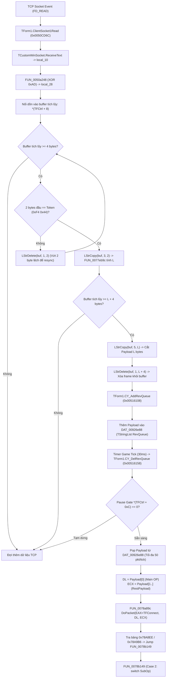

# Nghiên cứu Chi tiết: Toàn bộ Luồng Kết Nối, Hiển Thị Màn Hình Đăng Nhập & Gửi Gói Tin Auth (aLogin.exe)

Ngày: 2026-09-10  
Workspace: `/mnt/d/VUDT/GIT_PCC/test`  
Tài liệu tham chiếu chính: Mã nguồn C decompile và x86 Assembly trong `ts_decompile/functions/`, `ts_decompile/case_functions/` và các dump nhị phân trong `ts_decompile/redump/`.

---

## 1. Sự kiện Khi Client Kết Nối Thành Công (TForm1.ClientSocket1Connect)

### 1.1. Vị trí & Signature trong Primary Sources
* **Mã nguồn C**: [`0050cf4c_TForm1.ClientSocket1Connect.c`](file:///mnt/d/VUDT/GIT_PCC/test/ts_decompile/functions/0050cf4c_TForm1.ClientSocket1Connect.c#L22-L58)
* **Assembly**: [`0050cf4c_TForm1.ClientSocket1Connect.asm.txt`](file:///mnt/d/VUDT/GIT_PCC/test/ts_decompile/functions/0050cf4c_TForm1.ClientSocket1Connect.asm.txt#L1-L57)
* **Entry Address**: `0x0050CF4C` (Lưu ý: địa chỉ trong câu hỏi `0050cd1c` là độ lệch nhẹ; trong binary thực tế `0x0050CD6C` là `ClientSocket1Read`, `0x0050CF48` là literal `token_recv`, và `0x0050CF4C` là entry chính xác của `ClientSocket1Connect`).

### 1.2. Thao tác thực thi bên trong `TForm1.ClientSocket1Connect`
Khi socket TCP kết nối thành công đến Login Server (cổng `6416`), event handler `ClientSocket1Connect` được kích hoạt và thực hiện tuần tự:

1. **Ghi log giao diện**:
   * Gọi `FUN_00412f74` (`TStrings.Add`) thêm chuỗi thông báo kết nối tại địa chỉ `0x0050D01C` vào `Lines` của control memo tại `*(TForm1 + 0x2E0) + 0x208` ([asm lines 20–24](file:///mnt/d/VUDT/GIT_PCC/test/ts_decompile/functions/0050cf4c_TForm1.ClientSocket1Connect.asm.txt#L20-L24)).
2. **Lấy địa chỉ Local IP & ghi log**:
   * Gọi `TCustomWinSocket.GetLocalAddress(socket, &local_14)` (`0x0046B8A4`).
   * Ghi địa chỉ IP local này vào memo bằng `TStrings.Add` ([asm lines 25–32](file:///mnt/d/VUDT/GIT_PCC/test/ts_decompile/functions/0050cf4c_TForm1.ClientSocket1Connect.asm.txt#L25-L32)).
3. **Lưu Remote IP (Server IP) vào cấu trúc điều khiển mạng**:
   * Gọi `TCustomWinSocket.GetRemoteAddress(socket, &local_18)` (`0x0046B930`).
   * Gán chuỗi Remote IP vào trường `*(DAT_009264a4 + 0x24)` qua `_LStrAsg` ([asm lines 33–39](file:///mnt/d/VUDT/GIT_PCC/test/ts_decompile/functions/0050cf4c_TForm1.ClientSocket1Connect.asm.txt#L33-L39)).
4. **Lưu Local IP vào cấu trúc điều khiển mạng**:
   * Lấy lại Local IP qua `TCustomWinSocket.GetLocalAddress(socket, &local_1c)`.
   * Gán chuỗi Local IP vào trường `*(DAT_009264a4 + 0x28)` qua `_LStrAsg` ([asm lines 40–46](file:///mnt/d/VUDT/GIT_PCC/test/ts_decompile/functions/0050cf4c_TForm1.ClientSocket1Connect.asm.txt#L40-L46)).
5. **Dọn dẹp chuỗi cục bộ và RETURN**:
   * Gọi `_LStrArrayClr(&local_1c, 3)` và thoát hàm.

### 1.3. Kết luận về quyền gửi gói tin ban đầu
* Hàm `TForm1.ClientSocket1Connect` **hoàn toàn KHÔNG gọi** `SendText`, `CY_AddSedQueue` hay bất kỳ hàm gửi dữ liệu nào (`FUN_0077f414`).
* **KẾT LUẬN**: Client không gửi bất kỳ handshake hay ping nào ngay khi kết nối; **SERVER NÓI TRƯỚC (Server speaks first)**. Server chủ động gửi gói tin đầu tiên xuống Client để chỉ thị mở màn hình chọn server hoặc màn hình đăng nhập.

---

## 2. Gói Tin Server Gửi Xuống Để Mở Màn Hình Đăng Nhập

### 2.1. Main OP và Sub OP
Từ Jump Table decompile tại `FUN_0078a89c` và case function `FUN_0078b149`:
* **Main OP**: **`0x01`** (Không phải `0x00`. `0x00` dẫn tới Case 1 `FUN_0078aabe` – Error Notice / Force Disconnect).
* **Sub OP**: **`0x09`** (`case 9:` trong [`case_002_0078B149_FUN_0078b149.c:176`](file:///mnt/d/VUDT/GIT_PCC/test/ts_decompile/case_functions/functions/case_002_0078B149_FUN_0078b149.c#L176)).

### 2.2. Cấu Trúc Frame Trên Đường Truyền (Wire Format)
Mỗi frame trên đường truyền TCP giữa Server và Client có cấu trúc chuẩn 3 phần:
```
+---------------+------------------------+------------------------------------+
| Token (2B)    | Length L (Word LE, 2B) | Payload (L Bytes)                  |
+---------------+------------------------+------------------------------------+
```
1. **Token (2 Bytes)**:
   * Địa chỉ hằng số token nhận: `0x0050CF48`.
   * Giá trị trích xuất từ [`ts_decompile/redump/token_recv.hex`](file:///mnt/d/VUDT/GIT_PCC/test/ts_decompile/redump/token_recv.hex#L1): `0xF4, 0x44` (chuỗi ký tự nhị phân độ dài 2, tức Little-Endian `0x44F4`).
   * Token gửi đi tại `0x005163E0` ([`token_send.hex`](file:///mnt/d/VUDT/GIT_PCC/test/ts_decompile/redump/token_send.hex#L1)) cũng mang giá trị giống hệt: `0xF4, 0x44`.
2. **Length (2 Bytes Little-Endian)**:
   * Độ dài của phần `Payload` (không bao gồm 4 bytes header của Token + Length).
   * Giải mã bằng `FUN_0077eb9c`: `Length = byte0 + byte1 * 256`.
3. **Payload (3 Bytes cho gói tin kích hoạt màn hình đăng nhập)**:
   * `byte 0`: **`0x01`** (Main OP)
   * `byte 1`: **`0x09`** (Sub OP)
   * `byte 2`: **`sceneMode`** (1 byte giá trị chỉ số cảnh, ví dụ `0x5A` = 90 decimal).
   * Do đó: `Length = 0x0003` (Wire: `0x03, 0x00`).
4. **Mã hóa đối xứng XOR 0xAD**:
   * **Toàn bộ khung tin** (từ Token đến hết Payload) đều được mã hóa bằng cách XOR từng byte với hằng số tĩnh `0xAD` qua [`FUN_0050a248`](file:///mnt/d/VUDT/GIT_PCC/test/ts_decompile/functions/0050a248_FUN_0050a248.c#L73) (ở chiều nhận) và [`FUN_0050a2fc`](file:///mnt/d/VUDT/GIT_PCC/test/ts_decompile/functions/005163e4_TForm1.CY_DelSedQueue.asm.txt#L55) (ở chiều gửi).
   * Key tĩnh không thay đổi theo vị trí, không có rolling state, không phụ thuộc session.

#### Bảng minh họa byte thô (Raw Frame vs Wire XOR Frame):
Giả sử Server gửi lệnh chuyển sang Login Scene `sceneMode = 90` (`0x5A`):

| Phần tử | Ý nghĩa | Giá trị trước XOR (Plain) | Giá trị trên Wire (Plain XOR 0xAD) |
| :--- | :--- | :---: | :---: |
| **Token[0]** | Token byte 1 | `0xF4` | `0xF4 ^ 0xAD = 0x59` |
| **Token[1]** | Token byte 2 | `0x44` | `0x44 ^ 0xAD = 0xE9` |
| **Length[0]** | Payload len LSB | `0x03` | `0x03 ^ 0xAD = 0xAE` |
| **Length[1]** | Payload len MSB | `0x00` | `0x00 ^ 0xAD = 0xAD` |
| **Payload[0]**| Main OP | `0x01` | `0x01 ^ 0xAD = 0xAC` |
| **Payload[1]**| Sub OP | `0x09` | `0x09 ^ 0xAD = 0xA4` |
| **Payload[2]**| Scene Mode | `0x5A` (90) | `0x5A ^ 0xAD = 0xF7` |

*Chuỗi byte trên wire thực tế:* `59 E9 AE AD AC A4 F7` (7 bytes).

---

### 2.3. Quy Trình Bóc Tách PacketBuffer (Data Pipeline Từng Bước)

Luồng đi của dữ liệu từ khi nhận qua socket cho đến khi kích hoạt handler nghiệp vụ:



#### Chi tiết cài đặt trong primary sources:
1. **`TForm1.ClientSocket1Read`** ([`0050cd6c_TForm1.ClientSocket1Read.c:65-95`](file:///mnt/d/VUDT/GIT_PCC/test/ts_decompile/functions/0050cd6c_TForm1.ClientSocket1Read.c#L65-L95)):
   * Đọc raw string từ socket: `TCustomWinSocket_ReceiveText(param_3, &local_10)`.
   * Giải mã toàn bộ buffer XOR: `FUN_0050a248(DAT_009264a4, local_10, 0xad, &local_28)`.
   * Nối vào đệm dồn: `_LStrCat((int *)(DAT_009264a4 + 8), local_10)`.
   * Vòng lặp deframe kiểm tra `token` (`0x50cf48`). Nếu khớp, đọc length 2 bytes bằng `FUN_0077eb9c` ([lines 78–80](file:///mnt/d/VUDT/GIT_PCC/test/ts_decompile/functions/0050cd6c_TForm1.ClientSocket1Read.c#L78-L80)).
   * Cắt đúng `L` bytes payload: `_LStrCopy(..., 5, local_1c, &local_10)`.
   * Xóa frame khỏi đệm: `_LStrDelete(..., 1, local_1c + 4)`.
   * Đẩy vào hàng đợi: `TForm1_CY_AddRevQueue(local_8, local_10)`.
2. **`TForm1.CY_AddRevQueue`** ([`00516108_TForm1.CY_AddRevQueue.c:38`](file:///mnt/d/VUDT/GIT_PCC/test/ts_decompile/functions/00516108_TForm1.CY_AddRevQueue.c#L38)):
   * Gọi `FUN_00412f74(DAT_00926e88, payload)` (`TStrings.Add`), đưa payload vào `TStringList DAT_00926e88`.
3. **`TForm1.CY_DelRevQueue`** ([`00516158_TForm1.CY_DelRevQueue.c:59-111`](file:///mnt/d/VUDT/GIT_PCC/test/ts_decompile/functions/00516158_TForm1.CY_DelRevQueue.c#L59-L111)):
   * Kiểm tra điều kiện: Hàng đợi có phần tử và cờ tạm dừng `*(char *)(DAT_009264a4 + 0xc) == '\0'` (pause gate).
   * Lấy gói đầu tiên: `Get(0, &local_c)`.
   * Tách ký tự đầu: `MainOp = local_c[0]` (đưa vào thanh ghi `DL`).
   * Tách phần còn lại: `_LStrCopy(local_c, 2, len - 1, &RestPayload)` (đưa vào thanh ghi `ECX`).
   * Gọi điều phối: `FUN_0078a89c(DAT_009264a0, MainOp, RestPayload)`.
   * Xóa khỏi hàng đợi: `Delete(0)`. Giới hạn tối đa 50 gói / game tick (`0x31 < local_14`).
4. **Dispatcher `FUN_0078a89c`** ([`0078a89c_FUN_0078a89c.asm.txt:26-31`](file:///mnt/d/VUDT/GIT_PCC/test/ts_decompile/functions/0078a89c_FUN_0078a89c.asm.txt#L26-L31)):
   * `MOV AL, byte ptr [EAX + 0x78a8ee]` -> với `MainOp = 0x01`, giá trị byte tra được là `0x02`.
   * `JMP dword ptr [EAX*0x4 + 0x78a9b6]` -> với index `2`, dword target là `0x0078B149`.
   * Nhảy vào thực thi hàm `FUN_0078b149`.

---

## 3. Quá Trình Client Xử Lý Gói Tin Kích Hoạt Màn Hình Đăng Nhập

### 3.1. Luồng chạy trong `FUN_0078b149` (Case 9)
File: [`case_002_0078B149_FUN_0078b149.c`](file:///mnt/d/VUDT/GIT_PCC/test/ts_decompile/case_functions/functions/case_002_0078B149_FUN_0078b149.c#L28-L35)
1. Lấy byte đầu tiên của `RestPayload` (tức `payload[1]`):
   ```c
   iVar6 = *(int *)(unaff_EBP + -0xc); // RestPayload
   *(uint *)(unaff_EBP + -0x14) = (uint)*(byte *)(iVar6 + 0); // SubOp
   ```
2. Thực hiện `switch(SubOp)`:
   Khi `SubOp == 9` ([lines 176–179](file:///mnt/d/VUDT/GIT_PCC/test/ts_decompile/case_functions/functions/case_002_0078B149_FUN_0078b149.c#L176-L179)):
   ```c
   case 9:
     FUN_0051aae0(*(undefined4 *)gvar_007DA664, *(int *)(unaff_EBP + -0xc));
     switchD_00792e22::caseD_0();
     return;
   ```
   Hàm chuyển tiếp con trỏ `RestPayload` sang hàm chuyên trách `FUN_0051aae0`.

---

### 3.2. Hàm `FUN_0051aae0` Đọc `sceneMode` từ PacketBuffer
File: [`0051aae0_FUN_0051aae0.c:46-57`](file:///mnt/d/VUDT/GIT_PCC/test/ts_decompile/functions/0051aae0_FUN_0051aae0.c#L46-L57) & [`0051aae0_FUN_0051aae0.asm.txt:16-28`](file:///mnt/d/VUDT/GIT_PCC/test/ts_decompile/functions/0051aae0_FUN_0051aae0.asm.txt#L16-L28)

1. **Đọc `sceneMode`**:
   `param_2` chính là `RestPayload`. Trong assembly:
   ```asm
   MOV EAX, 0x2
   MOV EDX, dword ptr [EBP + -0x8]    ; EDX = RestPayload
   DEC EAX                            ; EAX = 1
   CMP EAX, dword ptr [EDX + -0x4]    ; Kiểm tra len(RestPayload) >= 2
   JC 0x0051ab12
   CALL 0x00402fa8                    ; BoundErr nếu không đủ 2 bytes
   INC EAX                            ; EAX = 2
   MOV AL, byte ptr [EDX + EAX*0x1 + -0x1] ; Đọc byte tại offset 1 (1-based: ký tự thứ 2)
   MOV [0x00926fc6], AL               ; Lưu vào biến toàn cục DAT_00926fc6 (sceneMode)
   ```
   * Như vậy: `RestPayload[0]` là `SubOp` (0x09), `RestPayload[1]` là `sceneMode` (ứng với `payload[2]` của gói tin gốc).
2. **Ẩn cửa sổ Chọn Server (Server Selection Window)**:
   ```c
   (**(code **)(**(int **)gvar_007D9CC4 + 0x24))();
   ```
   * Gọi phương thức ảo VMT `+0x24` (`Hide`) của instance form `*(gvar_007D9CC4)`.
   * Form tại `gvar_007D9CC4` chính là hộp thoại chọn cụm server (`TFrmSelectServer`, khởi tạo trong [`007083b4_FUN_007083b4.c:63-68`](file:///mnt/d/VUDT/GIT_PCC/test/ts_decompile/functions/007083b4_FUN_007083b4.c#L63-L68) chứa icon `"icon_ServerSignal"` và `"icon_SelectServer"`).

---

### 3.3. Hàm Kiểm Tra `FUN_00504c9c`: Bản Chất Điều Kiện `(sceneMode % 100) + 0xA6 < 10`
File: [`00504c9c_FUN_00504c9c.c`](file:///mnt/d/VUDT/GIT_PCC/test/ts_decompile/functions/00504c9c_FUN_00504c9c.c#L51-L66) & [`00504c9c_FUN_00504c9c.asm.txt`](file:///mnt/d/VUDT/GIT_PCC/test/ts_decompile/functions/00504c9c_FUN_00504c9c.asm.txt#L10-L26)

#### Phân tích mã nguồn C & Assembly:
```c
bool FUN_00504c9c(undefined4 param_1, byte param_2)
{
  byte local_9;
  local_9 = param_2;
  if (100 < param_2) {
    local_9 = (byte)((uint)param_2 % 100);
  }
  return (byte)(local_9 + 0xa6) < 10;
}
```
Assembly tương ứng:
```asm
MOV AL, byte ptr [EBP + -0x5]   ; AL = local_9 (sau khi % 100 nếu > 100)
ADD AL, 0xa6                    ; AL = (local_9 + 166) & 0xFF
SUB AL, 0xa                     ; So sánh với 10
JNC 0x00504cdd                  ; Nhảy nếu không có Carry (AL >= 10)
MOV byte ptr [EBP + -0x6], 0x1  ; Nếu có Carry (AL < 10) -> return true
```

#### Chứng minh toán học & Tối ưu hóa của Compiler Borland Delphi:
Trong mã nguồn gốc Pascal/Delphi, lập trình viên viết biểu thức kiểm tra thuộc tập hợp:
```pascal
if (sceneMode mod 100) in [90..99] then ...
```
Compiler Borland Delphi 7 chuyển mệnh đề `x in [A..B]` thành phép kiểm tra khoảng không dấu: `(unsigned)(x - A) <= (B - A)`.  
Với `A = 90`, `B = 99`:
$$\text{Điều kiện:} \quad (x - 90) < 10$$
Trong số học bù 2 trên trường 8-bit unsigned (`uint8_t`):
$$-90 \equiv 256 - 90 = 166 = \mathtt{0xA6}$$
Do đó:
$$(x - 90) \pmod{256} = (x + \mathtt{0xA6}) \pmod{256}$$

Xét bảng giá trị của $x \in [0, 99]$:
1. **Khi $x < 90$** (ví dụ $x = 0$ đến $89$):  
   $$x + 166 \in [166, 255]$$  
   Không tràn 8-bit, giá trị nằm trong $[166, 255] \ge 10 \implies$ **FALSE**.
2. **Khi $x \in [90, 99]$**:  
   $$x + 166 \in [256, 265] \equiv [0, 9] \pmod{256}$$  
   Tràn số 8-bit (Carry bit bật), giá trị sau tràn là $(x - 90) \in [0, 9] < 10 \implies$ **TRUE**.
3. **Khi $x = 100$**:  
   $$100 + 166 = 266 \equiv 10 \pmod{256} \not< 10 \implies$ **FALSE**.

**KẾT LUẬN**: Hàm `FUN_00504c9c` trả về `TRUE` khi và chỉ khi `sceneMode % 100 ∈ [90..99]`. Trong giao thức client TS Online, toàn bộ các mã cảnh từ **90 đến 99** là các cảnh thuộc phân hệ Đăng nhập / Chọn nhân vật / Đăng nhập lại (Login Scenes).

---

### 3.4. Cửa Sổ / Form Đăng Nhập Được Kích Hoạt (`gvar_007D9E7C`)
Form đăng nhập được định danh qua biến con trỏ toàn cục: **`*(gvar_007D9E7C)`**.

#### Constructor & Cấu trúc thành phần UI:
Được khởi tạo trong luồng tải ngầm của game tại [`0051189c_FUN_0051189c.asm.txt:1761-1770`](file:///mnt/d/VUDT/GIT_PCC/test/ts_decompile/functions/0051189c_FUN_0051189c.asm.txt#L1761-L1770) thông qua constructor [`00708f38_FUN_00708f38.c`](file:///mnt/d/VUDT/GIT_PCC/test/ts_decompile/functions/00708f38_FUN_00708f38.c#L45-L105):
* **Lớp cơ sở**: Form đồ họa custom (`TSe_Form` / `TFrmLogin`), kế thừa panel giao diện kích thước `0x114` x `0x32`, load icon `"icon_id_Password"` ([line 51-53](file:///mnt/d/VUDT/GIT_PCC/test/ts_decompile/functions/00708f38_FUN_00708f38.c#L51-L53)).
* **Ô nhập Tài khoản (Account Edit Box)**:
  * Offset: **`form[0x4F]`** (tức `form + 0x13C`).
  * Loại: `TSe_Editor` (resource `"editorBG"`, vị trí $Y = \mathtt{0x18}$).
  * Chuỗi văn bản nhập vào lưu tại: `*(editor + 0x1A0)`.
* **Ô nhập Mật khẩu (Password Edit Box)**:
  * Offset: **`form[0x50]`** (tức `form + 0x140`).
  * Loại: `TSe_Editor` (resource `"editorBG"`, vị trí $Y = \mathtt{0x40}$).
  * Đặt cờ ẩn mật khẩu: `*(editor + 0x80) = 1` (chế độ Password Masking).
* **Nút bấm Đăng nhập (btn_logIn)**:
  * Offset: **`form[0x4C]`** (tức `form + 0x130`).
  * Loại: `TSe_FixedButton` (resource `"btn_logIn"`).
  * Gán sự kiện `OnClick`: `button[0x14] = (int)FUN_007095c0` ([line 91](file:///mnt/d/VUDT/GIT_PCC/test/ts_decompile/functions/00708f38_FUN_00708f38.c#L91)).
* **Nút bấm Hủy (btn_cancel)**:
  * Offset: **`form[0x4D]`** (tức `form + 0x134`).
  * Loại: `TSe_FixedButton` (resource `"btn_cancel"`).

---

### 3.5. Cơ Chế Xử Lý: Tài Khoản Đã Lưu (`DAT_0092530c`) vs Chưa Lưu Tài Khoản

Biến `DAT_0092530c` là con trỏ tới instance `TPlayer` đại diện cho người chơi máy khách (được tạo trong [`0050a4a0_TForm1.FormCreate.c:529`](file:///mnt/d/VUDT/GIT_PCC/test/ts_decompile/functions/0050a4a0_TForm1.FormCreate.c#L529)).
* `DAT_0092530c + 0x644`: Con trỏ `AnsiString` chứa Tên tài khoản đã lưu (Account Name).
* `DAT_0092530c + 0x648`: Mảng 7 bytes chứa Mật khẩu đã lưu (Password Buffer).

Trong [`0051aae0_FUN_0051aae0.c:58-73`](file:///mnt/d/VUDT/GIT_PCC/test/ts_decompile/functions/0051aae0_FUN_0051aae0.c#L58-L73):
```c
  bVar4 = FUN_00504c9c(*(undefined4 *)gvar_007DA6EC, DAT_00926fc6);
  if (!bVar4) {
    bVar4 = FUN_00504c9c(*(undefined4 *)gvar_007DA6EC, gvar_007D7488);
    if (!bVar4) {
      (**(code **)(**(int **)gvar_007D9E7C + 0x20))(); // Show Form nếu không phải Login Scene
      goto LAB_0051abcb;
    }
  }
  gvar_007D748C = 0;
  gvar_007D7488 = 0;
  // Điền tài khoản từ TPlayer vào form
  FUN_007b372c(*(int **)(*(int *)gvar_007D9E7C + 0x13c), *(undefined4 **)(DAT_0092530c + 0x644));
  // Điền mật khẩu từ TPlayer vào form
  _LStrFromString((int *)&local_10, (byte *)(DAT_0092530c + 0x648));
  FUN_007b372c(*(int **)(*(int *)gvar_007D9E7C + 0x140), local_10);
  // Gọi hàm kích hoạt đăng nhập
  FUN_007095c0(*(int **)gvar_007D9E7C);
  *(undefined1 *)(DAT_009264a4 + 0x1e) = 0;
```

#### So sánh 2 trường hợp:

| Tiêu chí | Trường hợp 1: Đã lưu Tài khoản / Mật khẩu | Trường hợp 2: Chưa lưu Tài khoản / Mật khẩu (Trống) |
| :--- | :--- | :--- |
| **Trạng thái tại `DAT_0092530c`** | `+0x644` chứa chuỗi tài khoản hợp lệ (vd: `"AP123456"`); `+0x648` chứa mật khẩu hợp lệ. | `+0x644` rỗng (`NIL` hoặc `""`); `+0x648` rỗng (`\0`). |
| **Điền vào Form** | Cả hai ô nhập `+0x13c` và `+0x140` được gán chuỗi tương ứng. | Cả hai ô nhập `+0x13c` và `+0x140` bị gán chuỗi rỗng. |
| **Thực thi trong `FUN_007095c0`** | Kiểm tra tiền tố và số hợp lệ $\to$ Password không rỗng $\to$ Pass validation. | Kiểm tra độ dài tài khoản: `_LStrLen < 3` $\to$ **Fail validation**. |
| **Hành vi Toast** | Không hiển thị toast lỗi nào. | Hiện toast lỗi `DAT_007098b8` (3000ms), gọi `FUN_007b37b0` focus vào ô tài khoản. |
| **Gửi gói tin `SendCommand(1)`** | **Tự động gọi `FUN_0077f414(..., 1)` ngay lập tức** (Auto-Login). | **Không gọi `FUN_0077f414`**, thoát khỏi hàm. |
| **Trạng thái hiển thị Form** | Form gọi `VMT + 0x24` (`Hide`), biến mất khỏi màn hình. | Form tiếp tục **hiển thị trên màn hình (`Show`)**, con trỏ nhấp nháy tại ô tài khoản chờ người dùng gõ phím. |

---

### 3.6. Hàm Xử Lý Khi Người Dùng Nhập Xong & Bấm Đăng Nhập (`FUN_007095c0`)
File: [`007095c0_FUN_007095c0.c`](file:///mnt/d/VUDT/GIT_PCC/test/ts_decompile/functions/007095c0_FUN_007095c0.c#L77-L174) & [`007095c0_FUN_007095c0.asm.txt`](file:///mnt/d/VUDT/GIT_PCC/test/ts_decompile/functions/007095c0_FUN_007095c0.asm.txt#L21-L190)

Hàm nhận tham số `param_1` là con trỏ `TFrmLogin` (`*(gvar_007D9E7C)`).

#### Quy trình thẩm định dữ liệu đầu vào:
1. **Kiểm tra tiền tố tài khoản (2 ký tự đầu)**:
   * Cắt 2 ký tự đầu: `_LStrCopy(*(param_1 + 0x13c + 0x1a0), 1, 2, &local_c)`.
   * Chuyển thành chữ in hoa: `UpperCase(local_c, &local_2c)`.
   * So sánh với tiền tố hệ thống cho phép (`0x7098a0` và `0x7098ac`, ví dụ `"AP"`, `"TS"`).
   * Nếu sai tiền tố: Hiện toast `DAT_007098b8` (3000ms), đặt focus `FUN_007b37b0` về ô tài khoản, **DỪNG LẠI**.
2. **Kiểm tra độ dài tối thiểu của tài khoản**:
   * Kiểm tra `_LStrLen >= 3` ([line 95](file:///mnt/d/VUDT/GIT_PCC/test/ts_decompile/functions/007095c0_FUN_007095c0.c#L95)). Nếu $< 3$, hiện toast `DAT_007098b8`, **DỪNG LẠI**.
3. **Chuẩn hóa chuỗi số (Ký tự thứ 3 trở đi)**:
   * Duyệt qua từng ký tự từ vị trí thứ 3: Nếu gặp ký tự khoảng trắng / ký tự phân cách `DAT_007098d4`, tự động đổi thành ký tự `'0'` (`0x30`) ([lines 101–130](file:///mnt/d/VUDT/GIT_PCC/test/ts_decompile/functions/007095c0_FUN_007095c0.c#L101-L130)).
4. **Phân tích số định danh tài khoản (`_ValLong`)**:
   * Cắt chuỗi số từ ký tự thứ 3: `_LStrCopy(local_c, 3, len - 2, &local_c)`.
   * Chuyển thành số nguyên: `local_18 = _ValLong(local_c, &local_14)`.
   * Nếu `local_14 != 0` (lỗi parse) hoặc `local_18 == 0` (ID = 0): Hiện toast `DAT_007098b8`, focus ô tài khoản, **DỪNG LẠI** ([line 142](file:///mnt/d/VUDT/GIT_PCC/test/ts_decompile/functions/007095c0_FUN_007095c0.c#L142)).
5. **Kiểm tra mật khẩu**:
   * Kiểm tra con trỏ chuỗi tại ô mật khẩu: `*(param_1 + 0x140 + 0x1a0) == 0` ([line 143](file:///mnt/d/VUDT/GIT_PCC/test/ts_decompile/functions/007095c0_FUN_007095c0.c#L143)).
   * Nếu mật khẩu rỗng: Hiện toast `DAT_007098e0` (thông báo yêu cầu nhập mật khẩu), **DỪNG LẠI**.
6. **Thực thi gửi xác thực**:
   * Khi mọi thông tin hợp lệ:
     ```c
     FUN_0077f414(*(undefined4 *)gvar_007D9D30, 1); // GỌI SENDCOMMAND(1) GỬI AUTH PACKET
     (**(code **)(*local_8 + 0x24))();              // Ẩn TFrmLogin (VMT + 0x24 Hide)
     (**(code **)(*DAT_0098c6b8 + 0x24))();         // Ẩn window phụ trợ
     FUN_007b372c((int *)local_8[0x50], 0);         // Xóa sạch chuỗi mật khẩu trong RAM
     ```

---

### 3.7. Cấu Trúc Gói Tin Xác Thực `SendCommand(1)` (Client → Server)
File: [`0077f414_FUN_0077f414.c:773-818`](file:///mnt/d/VUDT/GIT_PCC/test/ts_decompile/functions/0077f414_FUN_0077f414.c#L773-L818) & [`0077f414_FUN_0077f414.asm.txt:120-170`](file:///mnt/d/VUDT/GIT_PCC/test/ts_decompile/functions/0077f414_FUN_0077f414.asm.txt#L120-L170)

Tại `case 1:` của hàm `FUN_0077f414`:
1. **Lấy số định danh người chơi (Player Numeric ID)**:
   * Lưu vào `*(gvar_007DA7BC + 0x640) = playerID`.
2. **Ghép 5 khối dữ liệu thành Payload hoàn chỉnh (`_LStrCatN` 5 thành phần)**:
   * **Khối 1 (2 Bytes)**: `[0x01] [lenPw]`
     * Byte 0: `0x01` (Main OP Client $\to$ Server cho Auth).
     * Byte 1: `lenPw` (Độ dài chuỗi mật khẩu, 1 byte unsigned).
   * **Khối 2 (4 Bytes Little-Endian)**: `[playerID]`
     * Chuyển đổi số nguyên `playerID` thành 4 bytes binary Little-Endian qua hàm `FUN_0077ee84`.
   * **Khối 3 (2 Bytes)**: `[account_prefix]`
     * 2 ký tự tiền tố của tài khoản (ví dụ `"AP"`).
   * **Khối 4 (2 Bytes Little-Endian)**: `[0xBC, 0x00]`
     * Hằng số Word `0x00BC` (188 decimal) chuyển đổi qua `FUN_0077eb1c`.
   * **Khối 5 (N Bytes)**: `[password_string]`
     * Toàn bộ chuỗi mật khẩu nguyên bản người dùng nhập.

#### Bảng cấu trúc Payload Client $\to$ Server Auth:
```
+---------------+---------------+--------------------+---------------------+-------------------+---------------------+
| MainOp (0x01) | LenPw (1 Byte)| PlayerID (4B LE)   | AccPrefix (2 Bytes) | Constant 0x00BC   | Raw Password (NB)   |
+---------------+---------------+--------------------+---------------------+-------------------+---------------------+
| 1 Byte        | 1 Byte        | 4 Bytes            | 2 Bytes             | 2 Bytes (BC 00)   | LenPw Bytes         |
+---------------+---------------+--------------------+---------------------+-------------------+---------------------+
```
*Tổng độ dài Payload:* `L = 10 + LenPw` bytes.

3. **Đóng khung & Gửi qua Socket**:
   * Gọi `TForm1_CY_AddSedQueue(*(gvar_007DA664), payload)` ([line 815](file:///mnt/d/VUDT/GIT_PCC/test/ts_decompile/functions/0077f414_FUN_0077f414.c#L815)):
     * Thêm Token gửi: `0xF4, 0x44` (từ `0x005163E0`).
     * Thêm Length 2 bytes LE (`FUN_0077eb1c(L)`).
     * Ghép thành frame hoàn chỉnh: `[Token 2B] [Length 2B LE] [Payload L Bytes]`.
     * Đưa vào `DAT_00926e8c` (Send Queue).
   * Trên vòng lặp game tick tiếp theo, hàm `TForm1.CY_DelSedQueue` ([`005163e4_TForm1.CY_DelSedQueue.asm.txt:30-60`](file:///mnt/d/VUDT/GIT_PCC/test/ts_decompile/functions/005163e4_TForm1.CY_DelSedQueue.asm.txt#L30-L60)):
     * Kiểm tra khoảng cách gửi tối thiểu 100ms (`CALL 0x007c4d7c`).
     * Mã hóa toàn bộ frame bằng XOR `0xAD` qua `FUN_0050a2fc`.
     * Gửi byte stream qua hàm `TCustomWinSocket.SendText` (`0x0046BD78`).
   * **Che giấu mật khẩu trong bộ nhớ**: Ngay sau khi đưa payload vào queue gửi, client ghi đè ô mật khẩu bằng chuỗi giả `"12345678"` (`0x78a860`), sau đó xóa trắng ngay (`SetText(field, 0)`) để ngăn chặn việc dump bộ nhớ trích xuất password ([lines 816–817](file:///mnt/d/VUDT/GIT_PCC/test/ts_decompile/functions/0077f414_FUN_0077f414.c#L816-L817)).

---

## 4. Tóm Tắt Bản Đồ Gọi Hàm (Execution Flow Summary)

```
1. Client Kết Nối TCP:
   TForm1.ClientSocket1Connect (0x0050CF4C)
   └── Ghi memo, lưu Remote/Local IP vào TFCtrl+0x24/+0x28. KHÔNG gửi gói tin.

2. Server Gửi Lệnh Mở Màn Hình Login:
   Server -> Client: [F4 44] [03 00] [01 09 sceneMode] (Toàn bộ frame XOR 0xAD)

3. Client Nhận & Giải Mã Khung Tin:
   ClientSocket1Read (0x0050CD6C)
   ├── FUN_0050a248: Giải mã XOR 0xAD
   ├── Bóc tách [Token F4 44] [Length LE 03 00] [Payload 3B: 01 09 sceneMode]
   └── TForm1.CY_AddRevQueue (0x00516108) -> Lưu vào DAT_00926e88 (RevQueue)

4. Game Tick Điều Phối:
   TForm1.CY_DelRevQueue (0x00516158)
   ├── Pop DAT_00926e88 (pacing <= 50 pkt/tick, kiểm tra pause gate TFCtrl+0xC)
   ├── DL = 0x01 (Main OP), ECX = [09 sceneMode] (RestPayload)
   └── FUN_0078a89c DoPacket -> Tra bảng 0x78A8EE/0x78A9B6 -> FUN_0078b149

5. Xử Lý Nghiệp Vụ Scene & Login:
   FUN_0078b149 (Case 2)
   └── SubOp = 0x09 (case 9) -> FUN_0051aae0
       ├── Đọc sceneMode = RestPayload[1] -> lưu DAT_00926fc6
       ├── Ẩn TFrmSelectServer: (**gvar_007D9CC4 + 0x24)()
       ├── Kiểm tra: FUN_00504c9c(sceneMode) -> sceneMode % 100 in [90..99]
       ├── Điền Account & Password từ TPlayer (DAT_0092530c) vào TFrmLogin (gvar_007D9E7C)
       └── Gọi FUN_007095c0 (TFrmLogin)

6. Thẩm Định & Gửi Gói Tin Auth:
   FUN_007095c0 (Xử lý khi submit hoặc auto-login)
   ├── Thẩm định: 2 ký tự đầu tiền tố ("AP"/"TS"), độ dài >= 3, parse số định danh ID
   ├── Nếu thông tin rỗng/thiếu: Hiện Toast DAT_007098b8/DAT_007098e0, form giữ nguyên mở
   └── Nếu thông tin đầy đủ/hợp lệ:
       ├── FUN_0077f414(TFConnect, 1) -> SendCommand(1)
       │   ├── Ghép: [0x01][lenPw][playerID 4B LE][prefix 2B][0xBC 0x00][password]
       │   └── TForm1.CY_AddSedQueue -> Ghép Token F4 44 + Len LE -> Đẩy vào DAT_00926e8c
       ├── Ẩn TFrmLogin: (**TFrmLogin + 0x24)()
       └── CY_DelSedQueue -> Pacing 100ms -> XOR 0xAD -> SendText qua Socket
```
