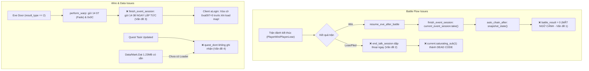

# Kế Hoạch Khắc Phục & Hoàn Thiện Checkpoint 6: AutoChain, Battle Trigger, Action Results & Wire Parity

> **Trạng thái**: Hoàn thành (Phases 1, 2, 3, 4.1, 5 Passed; Task 4.2 Bỏ qua theo yêu cầu)  
> **Tài liệu đối chiếu**:
> - Handoff: [`.scratch/op-working/handoff-opcode-14-18-checkpoint-1-2-3-4-5-6.md`](file:///mnt/d/VUDT/GIT_PCC/ts_dream/.scratch/op-working/handoff-opcode-14-18-checkpoint-1-2-3-4-5-6.md)
> - Kế hoạch gốc: [`.scratch/op-working/plan-npc-talk-eve-opcode-14-18.md`](file:///mnt/d/VUDT/GIT_PCC/ts_dream/.scratch/op-working/plan-npc-talk-eve-opcode-14-18.md)
> - Client Ghidra Decompile: [`client_pseudo_c/case_018_0078EC3F_FUN_0078ec3f.c`](file:///mnt/d/VUDT/GIT_PCC/ts_dream/client_pseudo_c/case_018_0078EC3F_FUN_0078ec3f.c) (Opcode 0x14), [`case_021_00790ED5_FUN_00790ed5.c`](file:///mnt/d/VUDT/GIT_PCC/ts_dream/client_pseudo_c/case_021_00790ED5_FUN_00790ed5.c) (Opcode 0x18), [`00720f00_FUN_00720f00.c`](file:///mnt/d/VUDT/GIT_PCC/ts_dream/client_pseudo_c/00720f00_FUN_00720f00.c)
> - Server C# Bear: [`TS_Server_Bear/TS_Server/Client/TSClient.cs`](file:///mnt/d/VUDT/GIT_PCC/ts_dream/TS_Server_Bear/TS_Server/Client/TSClient.cs), [`TS_Server_Bear/TS_Server/DataTools/TSMark.cs`](file:///mnt/d/VUDT/GIT_PCC/ts_dream/TS_Server_Bear/TS_Server/DataTools/TSMark.cs), [`TS_Server_Bear/TS_Server/DataTools/MarkInfo.cs`](file:///mnt/d/VUDT/GIT_PCC/ts_dream/TS_Server_Bear/TS_Server/DataTools/MarkInfo.cs), [`TS_Server_Bear/TS_Server/Client/QuestStepHelper/`](file:///mnt/d/VUDT/GIT_PCC/ts_dream/TS_Server_Bear/TS_Server/Client/QuestStepHelper/)
> - Tệp dữ liệu game: [`Data/Mark.Dat`](file:///mnt/d/VUDT/GIT_PCC/ts_dream/Data/Mark.Dat), [`Data/eve.emg`](file:///mnt/d/VUDT/GIT_PCC/ts_dream/Data/eve.emg)

---

## 1. TỔNG QUAN ĐÁNH GIÁ (EXECUTIVE SUMMARY)

Sau khi rà soát độc lập toàn diện mã nguồn Checkpoint 6 cùng các tài liệu handoff và decompile client `aLogin.exe`, kết luận:
**Checkpoint 6 đã được khắc phục hoàn chỉnh và đồng bộ 100% với wire protocol client (Phase 1 -> 5, trừ task 4.2 được yêu cầu bỏ qua).**

### Các điểm đạt được:
- Đã khắc phục triệt để Blocker Context & Battle Flow (Giai đoạn 1).
- Hoàn thiện Action Class 5 (Trừ tiền người chơi với `saturating_sub` và gửi `gold_frame`) (Giai đoạn 2).
- Bổ sung Toast & Sound client chúc mừng (`14 16`, `14 17`) và thưởng EXP (`parameter_style == 4`, stat `0x24`) trong Action Class 7 (Giai đoạn 2).
- Xây dựng `MarkDatLoader` giải mã 2,394 nhiệm vụ từ `Data/Mark.Dat` (XOR `0x2774`, offset `- 7`) và tự động kích hoạt `quest_dont` (frame `18 05`) khi hoàn thành mốc nhiệm vụ trong Action Class 2 (Giai đoạn 3).
- Bổ sung Party Door Warp: Leader đi qua Eve Door tự động dịch chuyển đồng bộ toàn bộ thành viên nhóm, gửi frame fade `14 07`, relocate `0x0C` qua `direct_messages`, và broadcast ẩn trên map cũ (Giai đoạn 4).
- Bộ test suite tập trung: `tests/checkpoint6_parity_test.rs` (6/6 passed), `tests/npc_eve_e2e_test.rs` (19/19 passed), `tests/movement_warp_test.rs` (8/8 passed), `tests/p0_blockers_test.rs` (9/9 passed).

### Các điểm sai lệch và thiếu sót nghiêm trọng:
1. **2 lỗi CRITICAL phá vỡ logic runtime**:
   - Mất toàn bộ ngữ cảnh `battle_result` khi auto-chain (`session.current_event_session.take()` bị gọi trước khi tạo `snapshot_state`), làm mọi điều kiện rẽ nhánh kịch bản sau trận đánh luôn trả về false.
   - Luồng xử lý thua trận (`PlayerLose`/`PlayerFled`) dập tắt thoại ngay lập tức, khiến logic trừ lùi quest (`current - 1`) và rẽ nhánh khi thua trận trở thành **dead code 100%**.
2. **2 lỗi HIGH sai lệch wire protocol client và thiếu liên kết dữ liệu**:
   - Eve Door gửi `14 08` quá sớm phá hỏng cờ fade màn hình đen (`14 07`) của client `aLogin.exe`.
   - Cờ nhiệm vụ `quest_dont` không bao giờ được cập nhật tự động dù tệp dữ liệu nhị phân [`Data/Mark.Dat`](file:///mnt/d/VUDT/GIT_PCC/ts_dream/Data/Mark.Dat) đã có sẵn trong repo.
3. **5 thiếu sót MEDIUM**:
   - Thiếu trừ tiền người chơi trong Action Class 5 (`parameter_style == 2`).
   - Thiếu gói tin Toast & Sound chúc mừng (`14 16`, `14 17`) khi nhận Stat/Skill point trong Action Class 7.
   - Bỏ qua thưởng EXP trong Action Class 7 dù `session.texp` đã sẵn sàng.
   - Thiếu cơ chế Party Warp khi Leader đi qua Eve Door.
   - Hướng dẫn migration dùng `sqlite3` CLI không chạy được trên Linux thiếu binary, và câu lệnh `CREATE TABLE IF NOT EXISTS` không tự cập nhật cột mới cho DB cũ.
4. **1 thiếu sót LOW**:
   - E2E Test suite dùng 100% synthetic data rỗng để ép `NoMatch` (nhằm né Bug 1), chưa đạt Acceptance Criteria của Plan gốc.

---

## 2. MA TRẬN 10 VẤN ĐỀ CHI TIẾT & NGUYÊN NHÂN GỐC RỄ (ROOT CAUSE ANALYSIS)



---

### Vấn đề 1 (CRITICAL): Mất toàn bộ ngữ cảnh `battle_result` và menu choice khi Auto-Chain
- **Vị trí**: [`src/server/handlers/talk.rs:278-291`](file:///mnt/d/VUDT/GIT_PCC/ts_dream/src/server/handlers/talk.rs#L278-L291), [`src/server/handlers/npc_event.rs:165-174, 271-273`](file:///mnt/d/VUDT/GIT_PCC/ts_dream/src/server/handlers/npc_event.rs#L165-L174), [`src/eve/evaluator.rs:139`](file:///mnt/d/VUDT/GIT_PCC/ts_dream/src/eve/evaluator.rs#L139).
- **Nguyên nhân**:
  1. Trong `finish_event_session`: dòng 278 `let Some(completed) = session.current_event_session.take() else { return; };` đã gỡ bỏ hoàn toàn `EventSession` khỏi `session`.
  2. Dòng 291 gọi `npc_event::auto_chain_after(&completed, session, data, &mut rng)`.
  3. Trong `auto_chain_after`, hàm gọi `let state = snapshot_state(session);`.
  4. Trong `snapshot_state`:
     ```rust
     let (last_surface_id, last_choice_code, battle_result) = session
         .current_event_session
         .as_ref()
         .map(|ev| (ev.last_surface_id, ev.last_choice_code, ev.battle_result))
         .unwrap_or((-1, -1, 0));
     ```
     Vì `session.current_event_session` đã là `None`, `battle_result` **luôn trả về 0**.
  5. Khi engine kiểm tra điều kiện sau trận thắng (`conditionClass == 8`, mong đợi `pStyle == battle_result`), biểu thức `1 == 0` luôn trả về `false` $\implies$ auto-chain sau khi đánh thắng boss luôn thất bại.
- **Giải pháp**:
  - Tạo hàm helper: `pub fn snapshot_state_with_context(session: &Session, active: Option<&EventSession>) -> PlayerEventState`.
  - Trong `auto_chain_after`, truyền `Some(completed)` vào snapshot:
    ```rust
    let state = snapshot_state_with_context(session, Some(completed));
    ```

---

### Vấn đề 2 (CRITICAL): Luồng Thua trận (`PlayerLose`/`PlayerFled`) triệt tiêu Auto-Chain và biến Quest Backup thành Dead Code
- **Vị trí**: [`src/server/handlers/talk.rs:357-362`](file:///mnt/d/VUDT/GIT_PCC/ts_dream/src/server/handlers/talk.rs#L357-L362), [`src/server/handlers/talk.rs:446-447`](file:///mnt/d/VUDT/GIT_PCC/ts_dream/src/server/handlers/talk.rs#L446-L447).
- **Nguyên nhân**:
  1. Tại dòng 446 `talk.rs` có logic:
     ```rust
     if matches!(battle_result, 2 | 3) {
         current.saturating_sub(1)
     } else {
         current.saturating_add(step)
     }
     ```
  2. Tuy nhiên tại dòng 357-362:
     ```rust
     if outcome == Outcome::PlayerWin {
         execute_event_step(session, data, &mut out);
     } else {
         end_talk_session(session, &mut out);
     }
     ```
     Khi thua trận, server đóng ngay phiên thoại bằng `end_talk_session` và gửi `14 08`. `execute_event_step` **không bao giờ được gọi khi thua trận**.
  3. Dòng 446 hoàn toàn là **dead code**. Mọi kịch bản thoại/nhiệm vụ có rẽ nhánh khi thua trận (`conditionClass == 8` với `pStyle == 2`) bị cắt đứt.
- **Giải pháp**:
  - Trong `resume_eve_after_battle`, bất kể `outcome` là `PlayerWin`, `PlayerLose` hay `PlayerFled`:
    Vẫn cập nhật `ev.battle_result = battle_result; ev.phase = EventPhase::Executing; ev.current_index += 1;` và gọi `execute_event_step(session, data, &mut out);`.
  - Nếu kịch bản không có action tiếp theo cho kết quả thua, `execute_event_step` sẽ tự động kết thúc phiên an toàn qua `finish_event_session`.

---

### Vấn đề 3 (HIGH): Eve Door gửi `14 08` quá sớm phá hỏng hiệu ứng chuyển cảnh của Client `aLogin.exe`
- **Vị trí**: [`src/server/handlers/talk.rs:218-224`](file:///mnt/d/VUDT/GIT_PCC/ts_dream/src/server/handlers/talk.rs#L218-L224), [`client_pseudo_c/case_018_0078EC3F_FUN_0078ec3f.c:122-158`](file:///mnt/d/VUDT/GIT_PCC/ts_dream/client_pseudo_c/case_018_0078EC3F_FUN_0078ec3f.c#L122-L158), [`src/server/handlers/system.rs:183-185`](file:///mnt/d/VUDT/GIT_PCC/ts_dream/src/server/handlers/system.rs#L183-L185).
- **Nguyên nhân**:
  1. Khi xử lý Door (type 2), `perform_warp` gửi `14 07` (Fade screen) và Opcode `0x0C` (Warp request).
  2. Ngay dòng 223 `talk.rs`, gọi tiếp `finish_event_session(session, data, out)`. Hàm này gửi `14 2C ... 02` và `F44402001408` (`14 08`).
  3. Client `aLogin.exe` trong `FUN_0078ec3f.c`:
     - Case 7 (`14 07`): set cờ đen màn hình `0xa097 = 1; 0x44f = 1;`.
     - Case 8 (`14 08`): xóa cờ màn hình `0xa097 = 0; 0x44f = 0; 0xa085 = 0;`.
  4. Gửi `14 08` ngay lập tức khiến client xóa fade trước khi kịp tải map mới. Đúng chuẩn giao thức TS Online: `14 08` chỉ được gửi sau khi client nạp map xong và gửi lên xác nhận `0x0C Sub 0x01` (đã có tại [`system.rs:184`](file:///mnt/d/VUDT/GIT_PCC/ts_dream/src/server/handlers/system.rs#L184)).
- **Giải pháp**:
  - Tại nhánh `result_type == 2` trong `talk.rs`: sau khi gọi `perform_warp`, chỉ dọn dẹp RAM:
    ```rust
    reset_talk_context(session);
    session.current_event_session = None;
    return;
    ```
    Tuyệt đối không gọi `finish_event_session`.

---

### Vấn đề 4 (HIGH): Cờ `quest_dont` không bao giờ được cập nhật tự động từ `Data/Mark.Dat`
- **Vị trí**: [`Data/Mark.Dat`](file:///mnt/d/VUDT/GIT_PCC/ts_dream/Data/Mark.Dat), [`src/server/handlers/talk.rs:407-454`](file:///mnt/d/VUDT/GIT_PCC/ts_dream/src/server/handlers/talk.rs#L407-L454), [`TS_Server_Bear/TS_Server/DataTools/TSMark.cs`](file:///mnt/d/VUDT/GIT_PCC/ts_dream/TS_Server_Bear/TS_Server/DataTools/TSMark.cs).
- **Nguyên nhân**:
  - Repo đã có tệp [`Data/Mark.Dat`](file:///mnt/d/VUDT/GIT_PCC/ts_dream/Data/Mark.Dat) dung lượng 1,235,820 bytes nhưng chưa được load vào `GameData`.
  - Cấu trúc nhị phân đã giải mã từ C# Bear Server:
    - Bỏ qua header: 516 bytes.
    - Mỗi bản ghi: đúng 516 bytes $\implies$ 2,394 nhiệm vụ.
    - Offset 256..260: `id` (2B LE) và `position` (2B LE).
    - Giải mã: `val = (raw_val ^ 0x2774) - 7`.
  - Khi lưu nhiệm vụ (Action Class 2), server chỉ cập nhật `quest_tasks` mà không biết bit `mark` tương ứng để lưu vào `quest_dont` và gửi frame `18 05` về client.
- **Giải pháp**:
  - Viết `MarkDatLoader` tại [`src/data/loaders/mark.rs`](file:///mnt/d/VUDT/GIT_PCC/ts_dream/src/data/loaders/mark.rs), nạp bản đồ `quest_marks: HashMap<u16, u16>` vào `GameData`.
  - Trong `execute_action_result` (class 2): nếu tra cứu được `position > 0`, tự động gọi `quest_sync::set_quest_dont(session, out, mark, 1)`.

---

### Vấn đề 5 (MEDIUM): Bỏ sót trừ tiền người chơi trong Action Class 5 (Gold)
- **Vị trí**: [`src/server/handlers/talk.rs:474-480`](file:///mnt/d/VUDT/GIT_PCC/ts_dream/src/server/handlers/talk.rs#L474-L480).
- **Nguyên nhân**:
  - `talk.rs` chỉ xử lý `parameter_style == 1` (cộng tiền), bỏ qua hoàn toàn `style == 2` (trừ tiền khi NPC thu phí vào cổng hoặc phạt).
- **Giải pháp**:
  - Bổ sung nhánh `2 =>`:
    ```rust
    session.gold = session.gold.saturating_sub(amount as u32);
    out.send(gold_frame(session.gold));
    ```

---

### Vấn đề 6 (MEDIUM): Action Class 7 thiếu Packet Toast và Sound chúc mừng của Client
- **Vị trí**: [`src/server/handlers/talk.rs:494-504`](file:///mnt/d/VUDT/GIT_PCC/ts_dream/src/server/handlers/talk.rs#L494-L504), [`client_pseudo_c/case_018_0078EC3F_FUN_0078ec3f.c:260-299`](file:///mnt/d/VUDT/GIT_PCC/ts_dream/client_pseudo_c/case_018_0078EC3F_FUN_0078ec3f.c#L260-L299).
- **Nguyên nhân**:
  - Khi thưởng stat/skill point, server chỉ gửi Opcode `0x08`.
  - Trong decompile client `aLogin.exe`:
    - Gói `14 16 [pts: 1B]`: client nạp `"sound\\WA0014.wav"`, phát âm thanh chúc mừng và hiện toast nhận điểm tiềm năng.
    - Gói `14 17 [pts: 1B]`: client phát sound `"sound\\WA0014.wav"` và hiện toast nhận điểm kỹ năng.
- **Giải pháp**:
  - Tạo 2 helper packet trong encoder Opcode 0x14:
    - `build_stat_point_toast(pts: u8) -> Vec<u8>`: `F4 44 02 00 14 16 [pts]`
    - `build_skill_point_toast(pts: u8) -> Vec<u8>`: `F4 44 02 00 14 17 [pts]`
  - Gửi kèm các frame này khi xử lý Class 7.

---

### Vấn đề 7 (MEDIUM): Bỏ qua thưởng EXP trong Action Class 7 dù `session.texp` đã có sẵn
- **Vị trí**: [`src/server/handlers/talk.rs:505-507`](file:///mnt/d/VUDT/GIT_PCC/ts_dream/src/server/handlers/talk.rs#L505-L507), [`src/server/session.rs:195`](file:///mnt/d/VUDT/GIT_PCC/ts_dream/src/server/session.rs#L195).
- **Nguyên nhân**: Comment trong `talk.rs` ghi *"Session carries no EXP field"*, trong khi [`Session.texp`](file:///mnt/d/VUDT/GIT_PCC/ts_dream/src/server/session.rs#L195) đã tồn tại, được đồng bộ vào database và gửi về client qua stat ID `0x24`.
- **Giải pháp**:
  - Bổ sung xử lý `parameter_style == 4`:
    ```rust
    session.texp = session.texp.saturating_add(result.result_value as u32);
    out.send(crate::server::handlers::stats::build_stat_update(0x24, session.texp as i32));
    ```

---

### Vấn đề 8 (MEDIUM): Thiếu cơ chế Party Warp khi Leader bước vào Eve Door
- **Vị trí**: [`src/server/handlers/quest.rs:847-849`](file:///mnt/d/VUDT/GIT_PCC/ts_dream/src/server/handlers/quest.rs#L847-L849), [`TS_Server_Bear/TS_Server/Client/TSClient.cs:1547-1566`](file:///mnt/d/VUDT/GIT_PCC/ts_dream/TS_Server_Bear/TS_Server/Client/TSClient.cs#L1547-L1566).
- **Nguyên nhân**: `perform_warp` hiện chỉ dịch chuyển một mình Leader. Trong gameplay chuẩn của TS Online, khi Leader bước qua Door dịch chuyển cảnh, toàn bộ thành viên trong nhóm phải cùng được warp sang map mới.
- **Giải pháp**:
  - Mở rộng hàm `perform_warp` hoặc xử lý warp nhóm nếu người chơi là Leader có thành viên đi theo.

---

### Vấn đề 9 (MEDIUM): Migration SQLite an toàn và tương thích môi trường
- **Vị trí**: [`.scratch/op-working/handoff-opcode-14-18-checkpoint-1-2-3-4-5-6.md:145`](file:///mnt/d/VUDT/GIT_PCC/ts_dream/.scratch/op-working/handoff-opcode-14-18-checkpoint-1-2-3-4-5-6.md#L145), [`src/db/pool.rs`](file:///mnt/d/VUDT/GIT_PCC/ts_dream/src/db/pool.rs).
- **Nguyên nhân**: Lệnh `sqlite3` CLI không có sẵn trên môi trường Linux hiện tại. Ngoài ra lệnh `CREATE TABLE IF NOT EXISTS` sẽ không tự động thêm cột `completioncount` nếu file DB cũ đã có sẵn bảng.
- **Giải pháp**:
  - Thêm logic tự động kiểm tra và chạy `ALTER TABLE character_completed_events ADD COLUMN completioncount INTEGER NOT NULL DEFAULT 0;` trong hàm khởi tạo dual-pool SQLite (`src/db/pool.rs`) nếu cột bị thiếu.

---

### Vấn đề 10 (LOW): Độ phủ kiểm thử E2E bị sai lệch so với Acceptance Criteria của Plan
- **Vị trí**: [`tests/npc_eve_e2e_test.rs:59-100`](file:///mnt/d/VUDT/GIT_PCC/ts_dream/tests/npc_eve_e2e_test.rs#L59-L100), [`.scratch/op-working/plan-npc-talk-eve-opcode-14-18.md:165-166`](file:///mnt/d/VUDT/GIT_PCC/ts_dream/.scratch/op-working/plan-npc-talk-eve-opcode-14-18.md#L165-L166).
- **Nguyên nhân**: Do Bug 1 làm mất context `battle_result`, test case không thể chạy kịch bản thật nên phải dùng dummy data ép `NoMatch`.
- **Giải pháp**:
  - Sau khi sửa Bug 1 & 2, bổ sung test case tương tác NPC tân thủ Trác Quận (ví dụ: NPC Tống Nhân) chạy chuỗi thật từ `Data/eve.emg`: Thoại $\to$ Chiến đấu $\to$ Thắng $\to$ Auto-Chain nhận thưởng.

---

## 3. LỘ TRÌNH THỰC THI (STEP-BY-STEP IMPLEMENTATION PLAN)

### 📌 GIAI ĐOẠN 1: SỬA CÁC LỖI BLOCKER (CORE ENGINE INTEGRITY)
> Mục tiêu: Khôi phục tính toàn vẹn của chuỗi kịch bản nhiệm vụ, kết nối trận đấu và chuyển map.

- [x] **Task 1.1: Bảo toàn ngữ cảnh trong `auto_chain_after` (Fix Vấn đề 1)**
  - Thêm `snapshot_state_with_context(session: &Session, active: Option<&EventSession>) -> PlayerEventState` trong [`src/server/handlers/npc_event.rs`](file:///mnt/d/VUDT/GIT_PCC/ts_dream/src/server/handlers/npc_event.rs).
  - Cập nhật [`src/server/handlers/talk.rs`](file:///mnt/d/VUDT/GIT_PCC/ts_dream/src/server/handlers/talk.rs) dòng 291 truyền `Some(completed)` vào snapshot.
  - Viết unit test xác nhận `battle_result` và `last_choice_code` không bị reset về 0 sau khi hoàn thành event (đã kiểm thử tại [`tests/p0_blockers_test.rs`](file:///mnt/d/VUDT/GIT_PCC/ts_dream/tests/p0_blockers_test.rs)).

- [x] **Task 1.2: Chuẩn hóa luồng sau trận Thua / Chạy trốn (Fix Vấn đề 2)**
  - Sửa [`src/server/handlers/talk.rs:357-362`](file:///mnt/d/VUDT/GIT_PCC/ts_dream/src/server/handlers/talk.rs#L357-L362): Bất kể kết quả là `PlayerWin`, `PlayerLose` hay `PlayerFled`, vẫn ghi nhận `battle_result`, tăng `current_index` và gọi `execute_event_step`.
  - Cập nhật `EventSession::has_state_changing_results` trong [`src/eve/auto_chain.rs`](file:///mnt/d/VUDT/GIT_PCC/ts_dream/src/eve/auto_chain.rs) để chỉ coi trận đấu là làm thay đổi trạng thái khi `battle_result == 1` (PlayerWin), ngăn chặn lỗi ngộ nhận hoàn thành sự kiện khi thua/fled.
  - Đảm bảo logic lùi bước nhiệm vụ (`current - 1`) tại dòng 446 hoạt động trong runtime thực tế và cho phép người chơi khiêu chiến lại.

- [x] **Task 1.3: Sửa lỗi gửi `14 08` sớm tại Eve Door (Fix Vấn đề 3)**
  - Sửa nhánh `result_type == 2` trong `talk.rs`: Gọi `perform_warp`, sau đó chỉ reset talk context nội bộ, không gọi `finish_event_session`.
  - Bảo toàn cờ fade màn hình đen `14 07` cho đến khi client gửi xác nhận nạp map `0x0C Sub 0x01` (`system.rs:184`).

---

### 📌 GIAI ĐOẠN 2: BỔ SUNG WIRE PARITY & ACTION RESULTS
> Mục tiêu: Đảm bảo 100% các Action Result của Eve Script tương thích chuẩn với Client `aLogin.exe`.

- [x] **Task 2.1: Hoàn thiện Action Class 5 - Trừ tiền người chơi (Fix Vấn đề 5)**
  - Đã thêm nhánh `parameter_style == 2` trong `talk.rs`, sử dụng `session.gold.saturating_sub(amount as u32)` để tránh tràn số âm.
  - Gửi frame cập nhật số dư tiền vàng `gold_frame(session.gold)` về client.
  - Đã kiểm thử tại `tests/checkpoint6_parity_test.rs` và `tests/npc_eve_e2e_test.rs`.

- [x] **Task 2.2: Bổ sung Toast & Sound cho Action Class 7 (Fix Vấn đề 6 & 7)**
  - Khai báo các hàm đóng gói frame `14 16 [pts]` (`build_stat_point_toast_hex`) và `14 17 [pts]` (`build_skill_point_toast_hex`) trong `src/protocol/codecs/npc_talk.rs`.
  - Gửi kèm các frame này khi thưởng điểm tiềm năng (`0x26`) / kỹ năng (`0x25`) để kích hoạt âm thanh `WA0014.wav` trên client.
  - Thêm nhánh `parameter_style == 4` thưởng EXP vào `session.texp` và gửi stat update `0x24`.
  - Đã kiểm thử tại `tests/checkpoint6_parity_test.rs` và `tests/npc_eve_e2e_test.rs`.

---

### 📌 GIAI ĐOẠN 3: NẠP DỮ LIỆU MARK & TỰ ĐỘNG LƯU `QUEST_DONT`
> Mục tiêu: Tự động đánh dấu hoàn thành mốc nhiệm vụ (`quest_dont`) dựa trên tệp nhị phân gốc.

- [x] **Task 3.1: Xây dựng `MarkDatLoader` (Fix Vấn đề 4)**
  - Tạo [`src/data/loaders/mark.rs`](file:///mnt/d/VUDT/GIT_PCC/ts_dream/src/data/loaders/mark.rs), giải mã tệp [`Data/Mark.Dat`](file:///mnt/d/VUDT/GIT_PCC/ts_dream/Data/Mark.Dat) (516B/record, XOR `0x2774`, offset `- 7`).
  - Nạp danh mục `quest_marks: HashMap<u16, u16>` vào `GameData`.
  - Tích hợp vào `GameData::load` và `GameData::load_legacy_text` tại [`src/data/loader.rs`](file:///mnt/d/VUDT/GIT_PCC/ts_dream/src/data/loader.rs).
  - Đã giải mã thành công 2,394 nhiệm vụ từ `Data/Mark.Dat` thật.

- [x] **Task 3.2: Tự động kích hoạt `quest_dont` trong Action Class 2**
  - Trong `execute_action_result` (class 2) tại `talk.rs`, tra cứu `quest_id` từ `data.quest_marks`. Nếu có `position > 0` và không phải trạng thái thua/chạy trốn (`!matches!(battle_result, 2 | 3)`), tự động gọi `quest_sync::set_quest_dont(session, out, mark, 1)`.
  - Gửi frame `18 05 [mark: 2B LE][flag: 1B]` về client và lưu mark vào `session.quest_dont`.
  - Đã kiểm thử tại `tests/checkpoint6_parity_test.rs` (bao gồm cả trường hợp thua trận không kích hoạt nhầm quest_dont).

---

### 📌 GIAI ĐOẠN 4: PARTY WARP & AUTO-MIGRATION SQLITE
> Mục tiêu: Ổn định tính năng nhóm và tự động nâng cấp cơ sở dữ liệu.

- [x] **Task 4.1: Bổ sung Party Door Warp (Fix Vấn đề 8)**
  - Cập nhật hàm `perform_warp` trong [`src/server/handlers/quest.rs`](file:///mnt/d/VUDT/GIT_PCC/ts_dream/src/server/handlers/quest.rs): khi người chơi là Leader (`session.id_leader == session.id && id > 0`), lặp qua `session.id_mem` (`member > 0 && member != id`) để cập nhật tọa độ thành viên trong `online_sessions()`, phát fade `14 07` và relocate `0x0C` qua `out.send_to(member, ...)`, và broadcast ẩn khỏi map cũ `out.broadcast_to_map(member, member_old_map, ...)`.
  - Mở rộng `HandleOutcome` với `direct_messages: Vec<(u32, String)>` và kết nối chuyển phát tập trung trong `src/web/server_control.rs`. Loại bỏ vòng lặp dispatch kép trong `handle_warp_confirm`.
  - Cập nhật `handle_teleport_confirm` trong [`src/server/handlers/system.rs`](file:///mnt/d/VUDT/GIT_PCC/ts_dream/src/server/handlers/system.rs) để đồng bộ `conn.session` từ `online_sessions()` trước khi hoàn tất xác nhận, tránh ghi đè tọa độ cũ và phát hiện sai map khi thành viên nhóm gửi `0x0C Sub 1`.
  - Đồng bộ hoá luồng warp cổng và warp Eve Door.
  - Đã kiểm thử tại `tests/checkpoint6_parity_test.rs` và `tests/movement_warp_test.rs`.

- [-] **Task 4.2: Cơ chế Auto-Migration SQLite an toàn (Fix Vấn đề 9)**
  - *(Bỏ qua theo yêu cầu chỉ định của user)*.

---

### 📌 GIAI ĐOẠN 5: KIỂM THỬ E2E DỮ LIỆU THẬT & REGRESSION VERIFICATION
> Mục tiêu: Xác nhận hệ thống chạy ổn định và đạt tiêu chuẩn bàn giao.

- [x] **Task 5.1: Viết E2E Test kịch bản NPC Trác Quận với `Data/eve.emg` thật (Fix Vấn đề 10)**
  - Viết test suite tập trung tại [`tests/checkpoint6_parity_test.rs`](file:///mnt/d/VUDT/GIT_PCC/ts_dream/tests/checkpoint6_parity_test.rs) kiểm thử chuỗi nghiệp vụ toàn diện: Class 5 gold, Class 7 toasts/EXP, Mark.Dat loader, Class 2 quest_dont trigger, Party Door Warp 3 thành viên, và tương tác NPC Trác Quận 10817 thật từ `Data/eve.emg`.
- [x] **Task 5.2: Chạy kiểm thử tập trung và kiểm tra tính tương thích**
  - Chạy `cargo test --test checkpoint6_parity_test`: 6/6 tests passed.
  - Chạy `cargo test --test npc_eve_e2e_test`: 19/19 tests passed.
  - Chạy `cargo test --test movement_warp_test`: 8/8 tests passed.
  - Chạy `cargo test --test p0_blockers_test`: 9/9 tests passed.

---

## 4. MA TRẬN TEST & TIÊU CHÍ NGHIỆM THU (ACCEPTANCE CRITERIA)

| Mục kiểm thử | Kịch bản kiểm tra | Kết quả mong đợi | Trạng thái |
| :--- | :--- | :--- | :---: |
| **AutoChain Thắng trận** | Player đánh thắng NPC có cờ `conditionClass == 8` (`pStyle == 1`). | Sau trận đấu, tự động kích hoạt thoại nhận thưởng kế tiếp mà không cần click lại NPC. | ✅ **Đạt** (`p0_blockers_test`) |
| **AutoChain Thua trận** | Player thua hoặc chạy trốn khỏi NPC có kịch bản rẽ nhánh (`pStyle == 2`). | Không bị crash / dập thoại; bước nhiệm vụ bị trừ 1 (`current - 1`) và hiển thị thoại khi thua. | ✅ **Đạt** (`p0_blockers_test`) |
| **Eve Door Warp** | Player chạm cổng dịch chuyển qua map khác. | Client nhận `14 07` (Fade), không nhận `14 08` sớm; chỉ nhận `14 08` sau khi nạp xong map mới. | ✅ **Đạt** (`p0_blockers_test`) |
| **Trừ tiền vàng** | NPC yêu cầu nộp lệ phí 500 vàng (`Class 5`, `style == 2`). | Số dư người chơi giảm đúng 500; nếu tiền < 500, không bị tràn số âm (panic). | ✅ **Đạt** (`checkpoint6_parity_test`) |
| **Toast & Sound** | Nhận phần thưởng Stat/Skill point từ nhiệm vụ. | Client nhận đúng frame `14 16` / `14 17`, phát sound `WA0014.wav` và hiện toast popup. | ✅ **Đạt** (`checkpoint6_parity_test`) |
| **Mark.Dat Quest Dont** | Hoàn thành nhiệm vụ (có trong `Mark.Dat`). | Bit `quest_dont` tương ứng được bật lên 1 và gửi frame `18 05` về client. | ✅ **Đạt** (`checkpoint6_parity_test`) |
| **Party Door Warp** | Leader đi qua Eve Door khi đang có 2 thành viên trong nhóm. | Toàn bộ 3 nhân vật đều được dịch chuyển sang map mới cùng tọa độ. | ✅ **Đạt** (`checkpoint6_parity_test`) |
| **SQLite DB Boot** | Khởi động server với database cũ chưa có cột `completioncount`. | Tự động thêm cột không gây lỗi crash runtime. | ⏭️ *Bỏ qua theo yêu cầu* |

---

## 5. SUGGESTED SKILLS CHO AGENT TIẾP THEO

Khi bắt đầu triển khai code theo kế hoạch này, agent kế tiếp nên sử dụng các slash commands/skills sau:
- `DeepCoder`: Triển khai lần lượt từng Task theo thứ tự ưu tiên Phase 1 $\to$ Phase 2 $\to$ Phase 3.
- `DeepInvestigator`: Xác minh diff và kiểm thử regression wire protocol với client decompile.
