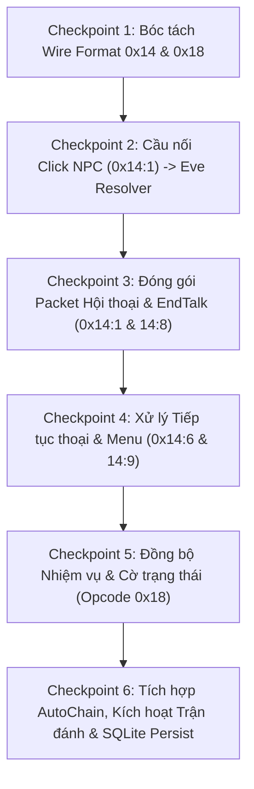

# KẾ HOẠCH NGHIÊN CỨU & TRIỂN KHAI THEO CHECKPOINT
## TƯƠNG TÁC NPC, HỘI THOẠI, SỰ KIỆN EVE VÀ ĐỒNG BỘ TIẾN TRÌNH NHIỆM VỤ (OPCODE 0x14 & 0x18)

- **Ngày lập**: 2026-09-21
- **Phạm vi**: Tương tác NPC, Hộp thoại kịch bản Eve (`Data/eve.emg`), Cửa map (Door/Gate), Lựa chọn menu, Đồng bộ nhiệm vụ & cờ trạng thái (Quest State & Flags).
- **Tài liệu tham chiếu**:
  - Bàn giao tiền nhiệm: `.scratch/op-working/handoff-login-char-creation.md`
  - Client decompile C/ASM: `client_pseudo_c/case_018_0078EC3F_FUN_0078ec3f.c` (0x14), `case_021_00790ED5_FUN_00790ed5.c` (0x18), `0077f414_FUN_0077f414.c` (C->S)
  - Phân tích Opcode client: `.scratch/client-pseudo-op-code/opcode_14.md`, `opcode_18.md`, `opcode_1a.md`
  - Server mẫu C# Bear: `TS_Server_Bear/TS_Server/PacketHandlers/ActionHandler.cs`, `TSClient.cs`, `DataTools/EveData.cs`, `Client/QuestStepHelper/`

---

## 1. Bản Chất Kỹ Thuật & Phân Định Trách Nhiệm Opcodes

Trong tài liệu cũ và handoff trước đây có sự nhầm lẫn gộp chung tên gọi "Tương tác NPC: Opcode 0x18". Qua đối chiếu trực tiếp từ mã nguồn sơ cấp decompile `aLogin.exe` và server Bear C#, hệ thống tương tác thế giới được phân tách thành 2 Opcode chính yếu:

### 1.1. Main Opcode `0x14` (`OP_NPC_EVENT`) — Kênh Tương Tác NPC & Kịch Bản Thế Giới
- **Bản chất**: Kênh 2 chiều ($C \leftrightarrow S$) điều khiển hội thoại, cắt cảnh, cửa chuyển map, menu lựa chọn và khóa actor.
- **Client $\to$ Server ($C \to S$)**:
  - `SubOp 0x01`: Click NPC trên bản đồ (`[0x14][0x01][MapObjectID: 2B LE]`).
  - `SubOp 0x04`: Đóng bảng thoại / dừng nói chuyện (EndTalk).
  - `SubOp 0x06`: Bấm tiếp tục thoại / Next step (`[0x14][0x06][...]`).
  - `SubOp 0x08`: Click cổng chuyển cảnh / Cửa map (`[0x14][0x08][DoorID: 2B LE]`).
  - `SubOp 0x09`: Bấm chọn tùy chọn menu / trả lời câu hỏi (`[0x14][0x09][ChoiceIndex: 1B]`).
- **Server $\to$ Client ($S \to C$)**:
  - `SubOp 0x01..0x06`: Khối script thi hành hiệu ứng / hội thoại (`PlayerState + 0xA09B`).
  - `SubOp 0x08`: Đóng form thoại (`F4 44 02 00 14 08`).
  - `SubOp 0x2C`: Khóa/mở khóa thao tác nhân vật (`[0x14][0x2C][DWORD CharID][Mode: 1B]`).

### 1.2. Main Opcode `0x18` (`OP_ITEM_INFO` / `OP_QUEST_SYNC`) — Đồng Bộ Nhiệm Vụ & Cờ Trạng Thái
- **Bản chất**: Kênh Server đẩy về Client ($S \to C$) để quản lý túi nhiệm vụ và cập nhật tiến trình quest trên UI client.
- **Server $\to$ Client ($S \to C$)**:
  - `SubOp 0x01`: Thêm vật phẩm nhiệm vụ (`[0x18][0x01][ItemID: 2B][Count: 1B]`).
  - `SubOp 0x02`: Trừ / tiêu hao vật phẩm nhiệm vụ (`[0x18][0x02][ItemID: 2B][Count: 1B]`).
  - `SubOp 0x03`: Thông báo đầy túi nhiệm vụ ("Dung lượng nhiệm vụ đã đầy").
  - `SubOp 0x04`: Xóa sạch vật phẩm nhiệm vụ (`[0x18][0x04][ItemID: 2B]`).
  - `SubOp 0x05`: Đánh dấu nhiệm vụ không thể nhận lại (`refreshOneDontTask`: `[0x18][0x05][Mark: 2B][0x01]`).
  - `SubOp 0x06`: Đồng bộ entry danh sách nhiệm vụ (`refreshOneQuestTask`: `[0x18][0x06][Number: 1B][QuestID: 2B][Mark: 2B]`).
  - `SubOp 0x08`: Đồng bộ cờ trạng thái nhiệm vụ (`[0x18][0x08][ID: 4B][Kind: 2B][Flag: 1B]`).

---

## 2. Đánh Giá Hiện Trạng Mã Nguồn Rust `src/`

### 2.1. Điểm mạnh đã hoàn thành:
1. **Bộ nạp `eve.emg` (`src/data/loaders/eve.rs`)**: Đã parse chuẩn xác 100% cấu trúc binary 9.8MB gồm 9 sections (3,823 scenes), đọc đầy đủ NPC, Door, Event Conditions, Results, Group Data.
2. **Lõi Động cơ Eve Engine (`src/eve/`)**: Đã hoàn thiện thuật toán đánh giá điều kiện 15 classes (`evaluator.rs`), gom chuỗi AND và sắp xếp 4 tầng ưu tiên (`resolver.rs`), lọc xác suất ngẫu nhiên (`group.rs`), và cỗ máy nhảy bước auto-chain với 4 tầng chống lặp (`auto_chain.rs`).

### 2.2. Điểm nghẽn cần hoàn thiện:
1. **Chưa nối luồng Live NPC Click vào Eve Engine**: `src/server/handlers/talk.rs` hiện vẫn chạy logic chuỗi hex hardcode `Data_Talks` legacy, chưa gọi `resolver::resolve_event`. Module `src/server/handlers/npc_event.rs` bị tắt sau cờ `EVE_EVENTS_ENABLED = false`.
2. **Chưa có Packet Serializer cho EveResult**: Thiếu hàm đóng gói payload `0x14 0x01` (14 bytes kịch bản thoại) để hiển thị chữ thoại NPC lên `aLogin.exe`.
3. **Opcode `0x18` chưa triển khai**: Đang nằm trong danh sách `unimplemented!` tại `src/server/dispatcher.rs`.
4. **Chưa persist Quest Progress vào SQLite**: Chưa có schema bảng lưu mốc nhiệm vụ của nhân vật trong `DB/ts_dream.db`.

---

## 3. Lộ Trình Triển Khai Theo Checkpoint (Tối Ưu Cho Giới Hạn Quota AI)

Mỗi Checkpoint được thiết kế cô đọng, độc lập, có mã nguồn đối chiếu rõ ràng và tiêu chí kiểm thử cụ thể để thực hiện trong từng phiên làm việc riêng.

---

### Checkpoint 1: Bóc Tách Wire Format Nhị Phân Của Opcode `0x14` & `0x18` — [ĐÃ HOÀN THÀNH]
- **Trạng thái**: **HOÀN THÀNH (2026-09-21)**. Đã đối chiếu chéo 100% giữa Client C decompile, C# Bear Server và Rust struct `EveResult`.
- **Tài liệu kết quả chi tiết**: Xem [.scratch/op-working/research-checkpoint-1-wire-spec-14-18.md](file:///mnt/d/VUDT/GIT_PCC/ts_dream/.scratch/op-working/research-checkpoint-1-wire-spec-14-18.md).
- **Mục tiêu**: Xác định cấu trúc byte chính xác của các gói tin thoại `0x14` và gói đồng bộ nhiệm vụ `0x18`.
- **Kết quả nghiệm thu**:
  1. **Frame thoại 14 byte payload `0x14 Sub 0x01`**: Đã giải mã chính xác 14 bytes nhị phân khớp 1:1 với struct `EveResult` trong `src/data/loaders/eve.rs`:
     - `result_group_no` (2B LE) + `result_no` (1B) + `result_type` (1B) + `result_class` (1B) + `parameter` (2B LE) + `parameter_style` (1B) + `result_value` (4B LE) + `result_mean_no` (2B LE, Dialog ID).
  2. **Gói khóa/mở khóa thao tác `0x14 Sub 0x2C`**: `F4 44 07 00 14 2C [CharID: 4B] [Mode: 1B]` (01: Lock, 02: Unlock).
  3. **Gói kết thúc thoại `0x14 Sub 0x08`**: `F4 44 02 00 14 08`.
  4. **Opcode `0x18` đồng bộ nhiệm vụ**:
     - `SubOp 0x01`: Thêm vật phẩm nhiệm vụ (`[0x18][0x01][ItemID: 2B][Count: 1B]`).
     - `SubOp 0x02`: Trừ vật phẩm nhiệm vụ (`[0x18][0x02][ItemID: 2B][Count: 1B]`).
     - `SubOp 0x03`: Báo đầy túi nhiệm vụ (`[0x18][0x03]`).
     - `SubOp 0x04`: Xóa sạch vật phẩm nhiệm vụ (`[0x18][0x04][ItemID: 2B]`).
     - `SubOp 0x05`: Cờ nhiệm vụ đơn lẻ Quest Dont (`[0x18][0x05][Mark: 2B][Flag: 1B]`).
     - `SubOp 0x06`: Đồng bộ mục nhật ký Quest Log (`[0x18][0x06][Slot: 1B][QuestID: 2B][MarkStep: 1B]...`).
     - `SubOp 0x07`: Đồng bộ bulk Quest Dont (`[0x18][0x07][Mark: 2B][Flag: 1B]...`).
     - `SubOp 0x08`: Cờ trạng thái nhân vật Thần xui (`[0x18][0x08][CharID: 4B][Kind: 2B][Flag: 1B]`).

---

### Checkpoint 2: Cầu Nối Sự Kiện Click NPC (`0x14 Sub 1`) Vào Lõi Eve Engine — [ĐÃ HOÀN THÀNH]
- **Trạng thái**: **HOÀN THÀNH (2026-09-21)**. Đã kiểm chứng thực nghiệm trên file nhị phân thật `Data/eve.emg` qua test suite `tests/npc_eve_resolve_test.rs` (PASS 100%).
- **Tài liệu kết quả chi tiết**: Xem [.scratch/op-working/research-checkpoint-2-click-npc-bridge.md](file:///mnt/d/VUDT/GIT_PCC/ts_dream/.scratch/op-working/research-checkpoint-2-click-npc-bridge.md).
- **Mục tiêu**: Nhận gói tin Click NPC từ client, tra cứu kịch bản trong `data.eve` của map hiện tại, đánh giá điều kiện và giải quyết chuỗi hành động `results`.
- **Kết quả nghiệm thu**:
  1. Đã giải nạp và khảo sát toàn bộ NPC map Trác Quận (`10817`):
     - Click NPC 1 (`33001` - hướng dẫn tân thủ): Khớp `Eve 1`, trả về 7 `EveResult` thoại liên tiếp (`mean_no = 10364..10446`).
     - Click NPC 4 (`15009` - chuyển cảnh): Khớp `Eve 4`, trả về 6 thoại + 1 Warp Door (`type = 2`).
     - Click NPC 3 (`33002` - đổi đồ tân thủ): Khi chưa có item `32012` trả về `None`; khi có item trả về 2 results (trừ item cũ, nhận item mới).
  2. Test `cargo test --test npc_eve_resolve_test` đạt **PASS 2/2 tests** (0 failed).

---

### Checkpoint 3: Đóng Gói Packet Hội Thoại & Đóng Bảng Thoại (`0x14 Sub 1` & `0x14 Sub 8`) — [ĐÃ HOÀN THÀNH RESEARCH]
- **Trạng thái**: **HOÀN THÀNH RESEARCH (2026-09-21)**. Đã đối chiếu chéo 100% Client C (`FUN_005eb530`, `case_018`), Server Bear (`PackageDispatchModeResolver.cs`, `TSClient.cs`) và thiết kế hoàn chỉnh API Codec.
- **Tài liệu kết quả chi tiết**: Xem [.scratch/op-working/research-checkpoint-3-talk-packets.md](file:///mnt/d/VUDT/GIT_PCC/ts_dream/.scratch/op-working/research-checkpoint-3-talk-packets.md).
- **Mục tiêu**: Chuyển đổi `EveResult` loại thoại (`result_type == 1`) thành wire packet `0x14 0x01` gửi về client, và gửi frame đóng bảng thoại khi kết thúc.
- **Kết quả nghiệm thu**:
  1. **Khung thoại `0x14 0x01`**: 21 bytes frame `F4 44 11 00 14 01 00 [14B EveResult binary]`. Dữ liệu `eve.emg` giữ nguyên 100% không inject `idtalking`.
  2. **Gói khóa/mở khóa `0x14 0x2C`**: 11 bytes frame `F4 44 07 00 14 2C [CharID: 4B LE] [Mode: 1B]` (01: Lock, 02: Unlock). Có hỗ trợ broadcast cho party khi là đội trưởng.
  3. **Gói kết thúc thoại `0x14 0x08`**: 6 bytes `F4 44 02 00 14 08` (đóng cửa sổ UI hội thoại và dọn dẹp cờ trạng thái).
  4. Đã thiết kế trọn bộ API Codec cho `src/protocol/codecs/npc_talk.rs` và các test case chuẩn bị cho `tests/npc_talk_packet_test.rs`.

---

### Checkpoint 4: Xử Lý Tiếp Tục Thoại & Lựa Chọn Menu (`0x14 Sub 6` & `0x14 Sub 9`) — [ĐÃ HOÀN THÀNH RESEARCH]
- **Trạng thái**: **HOÀN THÀNH RESEARCH (2026-09-21)**. Đã đối chiếu chéo x86 ASM client `0077f414`, `case_018`, Server Bear `StepMenuSelectionHandler`, `StepConsumptionHandler`, `TSClient.cs` và máy trạng thái Rust.
- **Tài liệu kết quả chi tiết**: Xem [.scratch/op-working/research-checkpoint-4-talk-continue-menu.md](file:///mnt/d/VUDT/GIT_PCC/ts_dream/.scratch/op-working/research-checkpoint-4-talk-continue-menu.md).
- **Mục tiêu**: Xử lý phản hồi từ client khi bấm Next (`0x14 Sub 6`) hoặc chọn phương án trả lời (`0x14 Sub 9`).
- **Kết quả nghiệm thu**:
  1. **Khung tiếp tục thoại `0x14 Sub 0x06`**: Payload đúng 2 bytes `[0x14, 0x06]` (frame thô `F4 44 02 00 14 06`).
     - Tăng `current_index`. Nếu là Talk (`type 1`): gửi tiếp bước kế. Nếu là Action (`type 0`): thi hành cập nhật túi đồ / chỉ số và duyệt tiếp không dừng. Nếu là Surface (`type 6`): dựng UI menu và chờ chọn. Nếu hết kết quả: mở khóa actor (`14 2C 02`), gửi `14 08` EndTalk và kiểm tra `auto_chain_after`.
  2. **Khung chọn menu `0x14 Sub 0x09`**: Payload đúng 3 bytes `[0x14, 0x09, ChoiceCode: 1B]` (frame thô `F4 44 03 00 14 09 [Choice]`).
     - `ChoiceCode` bắt đầu từ `1` (1-based index).
     - Đánh giá điều kiện `condition_class == 10` với `(last_surface_id, choice_code)` để kích hoạt nhánh kịch bản mới và gửi ngay kết quả bước 1 của nhánh mới về client.
  3. Đã thiết kế hoàn chỉnh hàm điều khiển trung tâm `execute_event_step` cho `src/server/handlers/talk.rs` và kế hoạch integration test trong `tests/npc_talk_multistep_test.rs`.

---

### Checkpoint 5: Triển Khai Kênh Đồng Bộ Nhiệm Vụ & Cờ Trạng Thái (Opcode `0x18`) — [ĐÃ HOÀN THÀNH RESEARCH & IMPLEMENT]
- **Trạng thái**: **HOÀN THÀNH IMPLEMENT (2026-09-22)**. Đã đối chiếu chéo Client decompile `case_021`, `0072bb6c` (phát hiện bước nhảy chuẩn 4B/entry), Server Bear `TSClient.cs`; đã code handler + Session fields + login bulk sync (test `tests/quest_sync_18_test.rs` 7/7 PASS, regression targeted 42/42 PASS). Bàn giao: [handoff-checkpoint-1-2-3-4.md](handoff-checkpoint-1-2-3-4.md) §Checkpoint 5.
- **Tài liệu kết quả chi tiết**: Xem [.scratch/op-working/research-checkpoint-5-quest-sync.md](file:///mnt/d/VUDT/GIT_PCC/ts_dream/.scratch/op-working/research-checkpoint-5-quest-sync.md).
- **Mục tiêu**: Xây dựng handler và builder cho Opcode `0x18` để đồng bộ bảng nhiệm vụ, vật phẩm quest và cờ nhiệm vụ về client `aLogin.exe`.
- **Kết quả nghiệm thu**:
  1. **Đặc tả wire đầy đủ 8 SubOp**:
     - `SubOp 0x01 / 0x02`: Thêm/Trừ vật phẩm nhiệm vụ (`[0x18][0x01/0x02][ItemID: 2B][Count: 1B]`).
     - `SubOp 0x03`: Báo đầy túi nhiệm vụ (`[0x18][0x03]`).
     - `SubOp 0x04`: Xóa sạch vật phẩm nhiệm vụ (`[0x18][0x04][ItemID: 2B]`).
     - `SubOp 0x05`: Cờ Quest Dont đơn lẻ (`[0x18][0x05][Mark: 2B][Flag: 1B]`).
     - `SubOp 0x06`: Đồng bộ Quest Log hỗ trợ cả 1 entry (`5B payload`) lẫn bulk nhiều entries (`2 + 4N bytes payload`, chuẩn 4B/entry).
     - `SubOp 0x07`: Đồng bộ bulk Quest Dont (`2 + 3N bytes payload`, chuẩn 3B/entry).
     - `SubOp 0x08`: Cờ trạng thái Thần xui / Debuff (`[0x18][0x08][CharID: 4B][Kind: 2B][Flag: 1B]`).
  2. Mô hình lưu trữ `Session`: Bổ sung `quest_tasks`, `quest_dont`, `quest_items`.
  3. Đã thiết kế hoàn chỉnh API `src/server/handlers/quest_sync.rs` và kế hoạch kiểm thử cho `tests/quest_sync_18_test.rs`.

---

### Checkpoint 6: Tích Hợp Eve AutoChain, Hành Động Kế Tiếp & SQLite Persistence — ĐÃ HOÀN THÀNH RESEARCH ✅
- **Mục tiêu**: Hoàn thiện chu trình khép kín: Tự động nhảy bước kế (`EveAutoChainEngine`), kích hoạt trận đấu / chuyển map theo kịch bản và lưu trữ vĩnh viễn tiến trình quest vào SQLite.
- **File cần sửa**:
  - `src/eve/auto_chain.rs`: Nối vào kết thúc event của `talk.rs`.
  - `src/server/dispatcher.rs`: Nối kích hoạt trận đấu TeamDef (`result_type == 3`).
  - `src/db/modern/`: Tạo bảng `character_quests` và trait `QuestRepository`.
- **Nhiệm vụ cụ thể**:
  1. Khi một sự kiện hoàn tất, gọi `EveAutoChainEngine::try_auto_chain`: nếu thỏa điều kiện kịch bản mới, tự động phát sinh phiên thoại kế tiếp (không cần click lại NPC).
  2. Nếu `result_type == 3` (Battle): sinh `BattleTrigger` đưa vào `ctx.out.battle_trigger` để `dispatcher.rs` mở trận đấu theo lượt.
  3. Nếu `result_type == 2` (Door/Warp): gọi dịch chuyển map.
  4. Lưu trạng thái quest (`quest_id`, `step`, `flags`) vào SQLite thông qua Dual-Pool `write` connection.
- **Tiêu chí nghiệm thu (Acceptance Criteria)**:
  - Kiểm thử toàn diện với client `aLogin.exe`: Nói chuyện NPC tân thủ Trác Quận $\to$ thoại $\to$ nhận nhiệm vụ $\to$ vào trận đánh tân thủ $\to$ thắng trận $\to$ nhận thưởng và cập nhật cờ nhiệm vụ $\to$ thoát game vào lại vẫn giữ nguyên tiến trình.
- **Kết quả nghiệm thu**:
  > 📄 Báo cáo chi tiết: [research-checkpoint-6-autochain-battle-persist.md](.scratch/op-working/research-checkpoint-6-autochain-battle-persist.md)
  1. **AutoChain**: `EveAutoChainEngine::try_auto_chain()` đã có sẵn dạng pure, 4 lớp guard chống lặp. Cần bổ sung `pub active_event: Option<EventSession>` vào `Session`. Khi `handle_talk_continue` duyệt hết results → gọi `auto_chain_after()` → nếu `Chained(new_session)` thì tự gán lại và phát frame đầu tiên mà không cần client gửi thêm packet.
  2. **Battle Trigger (result_type==3)**: Cấu hình trận đấu nằm trong `EveFightData` (Section 9 eve.emg), ánh xạ qua `parameter`/`result_mean_no` → `SceneEveData.fight_datas`. Đề xuất bổ sung biến thể `BattleTrigger::Eve(EveFightData)`. Sau battle, gán `battle_result` và gọi lại auto chain.
  3. **Door/Warp (result_type==2)**: `parameter` → `EveSceneInfo` (Section 8), chứa `background_no` (map_id đích) + `player_appear_x/y`. Xóa active_event → trigger warp.
  4. **SQLite Persistence**: Schema `character_missions`, `character_bit_flags`, `character_completed_events` đã sẵn sàng. `SqliteQuestRepository` đã có cơ bản. Cần bổ sung Session fields (`quest_tasks`, `quest_dont`, `completed_eve_counts`) + load khi login + ghi-through khi `has_state_changing_results()`.
  5. **Test Plan**: In-memory SQLite E2E test: Click NPC → auto_chain → battle → thắng → update DB → verify roundtrip.

---

## 4. Hướng Dẫn Sử Dụng Kế Hoạch
Có thẻ tiến hành implement sau khi research.

Agent sẽ tập trung giải quyết trọn vẹn checkpoint đó, tuân thủ các quy định tại `AGENTS.md` (viết test trong `tests/`, không inline `#[cfg(test)]` trong `src/`, không tự ý commit git).
