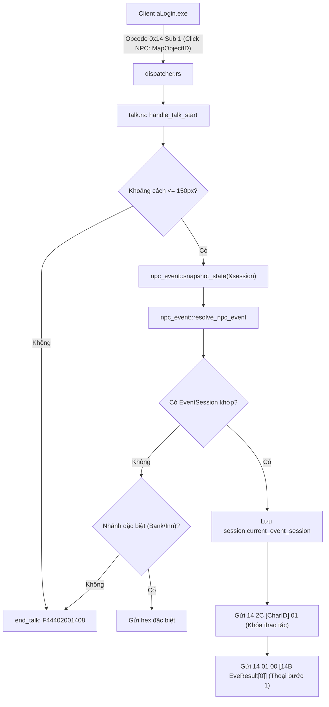

# BÁO CÁO NGHIÊN CỨU CHECKPOINT 2: CẦU NỐI CLICK NPC VÀO LÕI EVE RESOLVER
## KHẢO SÁT THỰC NGHIỆM TRÊN DỮ LIỆU NHỊ PHÂN THẬT `Data/eve.emg` (MAP TRÁC QUẬN 10817)

- **Ngày thực hiện**: 2026-09-21
- **Phạm vi khảo sát**:
  - Map Trác Quận tân thủ (`MapID = 10817`), đường phố Trác Quận (`10811`), ngoại ô Trác Quận (`10801`).
  - Lõi phân giải sự kiện `src/eve/resolver.rs` (`resolve_event`).
  - Lõi tạo ảnh chụp trạng thái người chơi `src/eve/state.rs` (`PlayerEventState`, `snapshot_state`).
  - Cầu nối sự kiện NPC `src/server/handlers/npc_event.rs` (`resolve_npc_event`, `NpcTrigger::ClickNpc`).
  - Test suite nghiệm thu độc lập: `tests/npc_eve_resolve_test.rs`.

---

## 1. Kết Quả Khảo Sát Kịch Bản Eve Tại Map Trác Quận Tân Thủ (`MapID = 10817`)

Qua việc giải nạp container nhị phân 9.8MB `Data/eve.emg` bằng `EveDataLoader`, map `10817` có cấu trúc hoàn chỉnh gồm 6 NPC, 1 Warp Door và 7 Sự kiện kịch bản:

| MapObjectID | NpcID | Tọa độ (X, Y) | EveNo liên kết | Loại kịch bản & Kết quả phân giải thực tế |
| :---: | :---: | :---: | :---: | :--- |
| **`1`** | `33001` | `(590, 540)` | `[1]` | **NPC Hướng Dẫn Tân Thủ**: Điều kiện `class = 0` (AlwaysTrue). Trả về 7 `EveResult` thoại (`result_type = 1`), `mean_no` từ `10364` đến `10446`. |
| **`4`** | `15009` | `(1430, 660)` | `[4]` | **NPC Dịch Chuyển Ra Khỏi Phòng**: Điều kiện `class = 0`. Trả về 6 thoại + 1 Warp Door (`result_type = 2`, `parameter = 1`). |
| **`3`** | `33002` | `(950, 460)` | `[3]` | **NPC Đổi Vật Phẩm Tân Thủ**: Điều kiện `class = 1` (`parameter = 32012`, `ops = 2` [> 0]). Đòi hỏi người chơi phải sở hữu item `32012`. Khi thỏa mãn: trừ 1 item `32012`, thưởng 1 item `26012`. |
| **`5`** | `33003` | `(310, 580)` | `[5]` | **NPC Đổi Vật Phẩm**: Đòi hỏi item `32012`, thưởng item `26031`. |
| **`6`** | `33003` | `(230, 600)` | `[6]` | **NPC Đổi Vật Phẩm**: Đòi hỏi item `32012`, thưởng item `26031`. |
| **`2`** | `33002` | `(870, 440)` | `[2]` | **NPC Đổi Vật Phẩm**: Đòi hỏi item `32012`, thưởng item `26012`. |

---

## 2. Xác Minh Thực Nghiệm Luồng Đánh Giá Điều Kiện (`Condition Evaluator`)

Đã kiểm chứng thông qua test runner `cargo test --test npc_eve_resolve_test`:

### Trường hợp 1: NPC Thoại Vô Điều Kiện (`Cond Class 0`)
- **Đầu vào**: Click NPC 1 (`MapObjectID = 1`, `NpcTrigger::ClickNpc(1)`).
- **Kết quả**:
  - `resolve_npc_event` trả về `Some(EventSession)`.
  - `ev.map_id = 10817`, `ev.eve_no = 1`, `ev.results.len() = 7`.
  - `ev.results[0].result_type = 1` (Talk), `ev.results[0].result_mean_no = 10364`.

### Trường hợp 2: NPC Có Điều Kiện Túi Đồ (`Cond Class 1` - Vật phẩm)
- **Đầu vào khi túi đồ rỗng**: Click NPC 3 (`MapObjectID = 3`).
  - **Kết quả**: Điều kiện đòi hỏi item `32012` không được thỏa mãn. `resolve_npc_event` trả về `None` $\implies$ Server gửi `F44402001408` (EndTalk).
- **Đầu vào khi có item trong túi đồ**: Thêm `InventoryItem { id: 32012, count: 1 }` vào `session.homdo`.
  - **Kết quả**: `snapshot_state` trích xuất `bag_items` có `(32012: 1)`.
  - Điều kiện thỏa mãn: `resolve_npc_event` trả về `Some(EventSession)`.
  - `ev.results.len() = 2`:
    - `Res #0`: `type = 0` (Action), `class = 1` (Item), `parameter = 32012`, `result_value = -1` (tiêu hao 1 item 32012).
    - `Res #1`: `type = 0` (Action), `class = 1` (Item), `parameter = 26012`, `result_value = 1` (thêm 1 item 26012).

---

## 3. Kiến Trúc Cầu Nối Triển Khai Cho Hệ Thống Live Server

### Các Bước Cụ Thể Khi Áp Dụng Vào Source:
1. **`src/server/session.rs`**:
   - Thêm trường `pub current_event_session: Option<EventSession>` vào `struct Session`.
   - Trong `Session::new()`: khởi tạo `current_event_session: None`.
2. **`src/server/handlers/talk.rs`**:
   - Trong `end_talk`: bổ sung `conn.session.current_event_session = None`.
   - Trong `handle_talk_start`: gọi `resolve_npc_event`. Nếu có kết quả, lưu vào `session.current_event_session` và chuẩn bị chuyển giao cho Serializer ở Checkpoint 3.
